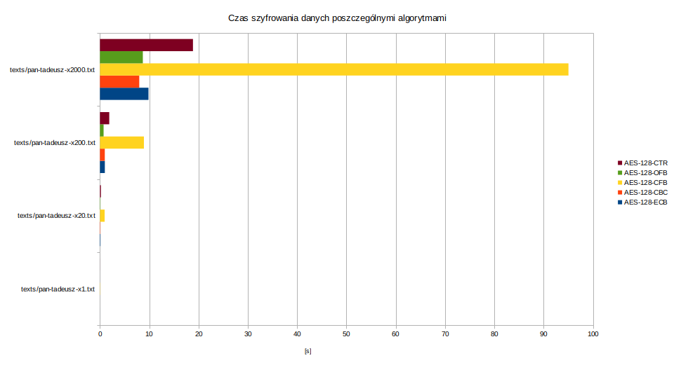

# 1. Testy szybkości

|Plik| Rozmiar  |
|---|:--------:|
|texts/pan-tadeusz-x1.txt|   492K   |
|texts/pan-tadeusz-x20.txt|   9,5M   |
|texts/pan-tadeusz-x200.txt|   95M    |
|texts/pan-tadeusz-x2000.txt|   942M   |



Czas szyfrowania plików jest liniowy. CFB jest o wyraźnie wolniejszy niż pozostałe tryby blokowe, które posiadają podobną charakterystykę.

# Anomalie
## AES-EBC
### Usunąć cały blok
Po prostu jest usuwany blok tekstu jawnego.

```bash
./diff.sh decrypted/same_byte-aes-ecb_delete_block.bin
```
```diff
6161 6161 6161 6161 6161 6161 6161 6161 aaaaaaaaaaaaaaaa        6161 6161 6161 6161 6161 6161 6161 6161 aaaaaaaaaaaaaaaa
6161 6161 6161 6161 6161 6161 6161 6161 aaaaaaaaaaaaaaaa        6161 6161 6161 6161 6161 6161 6161 6161 aaaaaaaaaaaaaaaa
6161 6161 6161 6161 6161 6161 6161 6161 aaaaaaaaaaaaaaaa        6161 6161 6161 6161 6161 6161 6161 6161 aaaaaaaaaaaaaaaa
6161 6161 6161 6161 6161 6161 6161 6161 aaaaaaaaaaaaaaaa        6161 6161 6161 6161 6161 6161 6161 6161 aaaaaaaaaaaaaaaa
6161 6161 6161 6161 6161 6161 6161 6161 aaaaaaaaaaaaaaaa     <
```
```bash
./diff.sh decrypted/alphabet-aes-ecb_delete_block.bin
```
```diff
6162 6364 6566 6768 696a 6b6c 6d6e 6f70 abcdefghijklmnop        6162 6364 6566 6768 696a 6b6c 6d6e 6f70 abcdefghijklmnop
7172 7374 7576 7778 797a 6162 6364 6566 qrstuvwxyzabcdef        7172 7374 7576 7778 797a 6162 6364 6566 qrstuvwxyzabcdef
6768 696a 6b6c 6d6e 6f70 7172 7374 7576 ghijklmnopqrstuv     <
7778 797a 6162 6364 6566 6768 696a 6b6c wxyzabcdefghijkl        7778 797a 6162 6364 6566 6768 696a 6b6c wxyzabcdefghijkl
6d6e 6f70 7172 7374 7576 7778 797a 6162 mnopqrstuvwxyzab        6d6e 6f70 7172 7374 7576 7778 797a 6162 mnopqrstuvwxyzab
```


```bash
./diff.sh decrypted/text-aes-ecb_delete_block.bin
```
```diff
 4c69 7477 6f2c 204f 6a63 7a79 7a6e 6f20 Litwo, Ojczyzno         4c69 7477 6f2c 204f 6a63 7a79 7a6e 6f20 Litwo, Ojczyzno
 6d6f 6a61 2120 7479 206a 6573 7465 7320 moja! ty jestes         6d6f 6a61 2120 7479 206a 6573 7465 7320 moja! ty jestes
 6a61 6b20 7a64 726f 7769 6520 496c 6520 jak zdrowie Ile      <
 6369 6520 7472 7a65 6261 2063 656e 6963 cie trzeba cenic        6369 6520 7472 7a65 6261 2063 656e 6963 cie trzeba cenic
 2c20 7465 6e20 7479 6c6b 6f20 7369 6520 , ten tylko sie         2c20 7465 6e20 7479 6c6b 6f20 7369 6520 , ten tylko sie
```

### Powielić cały blok
Został dodany nowy blok w wiadomosci janwej.
```bash
 ./diff.sh decrypted/alphabet-aes-ecb_duplicate_block.bin
```
```diff
 6162 6364 6566 6768 696a 6b6c 6d6e 6f70 abcdefghijklmnop        6162 6364 6566 6768 696a 6b6c 6d6e 6f70 abcdefghijklmnop
 7172 7374 7576 7778 797a 6162 6364 6566 qrstuvwxyzabcdef        7172 7374 7576 7778 797a 6162 6364 6566 qrstuvwxyzabcdef
 6768 696a 6b6c 6d6e 6f70 7172 7374 7576 ghijklmnopqrstuv        6768 696a 6b6c 6d6e 6f70 7172 7374 7576 ghijklmnopqrstuv
                                                              >  6768 696a 6b6c 6d6e 6f70 7172 7374 7576 ghijklmnopqrstuv
 7778 797a 6162 6364 6566 6768 696a 6b6c wxyzabcdefghijkl        7778 797a 6162 6364 6566 6768 696a 6b6c wxyzabcdefghijkl
 6d6e 6f70 7172 7374 7576 7778 797a 6162 mnopqrstuvwxyzab        6d6e 6f70 7172 7374 7576 7778 797a 6162 mnopqrstuvwxyzab
```
```bash
 ./diff.sh decrypted/same_byte-aes-ecb_duplicate_block.bin
```
```diff
 6161 6161 6161 6161 6161 6161 6161 6161 aaaaaaaaaaaaaaaa        6161 6161 6161 6161 6161 6161 6161 6161 aaaaaaaaaaaaaaaa
 6161 6161 6161 6161 6161 6161 6161 6161 aaaaaaaaaaaaaaaa        6161 6161 6161 6161 6161 6161 6161 6161 aaaaaaaaaaaaaaaa
 6161 6161 6161 6161 6161 6161 6161 6161 aaaaaaaaaaaaaaaa        6161 6161 6161 6161 6161 6161 6161 6161 aaaaaaaaaaaaaaaa
 6161 6161 6161 6161 6161 6161 6161 6161 aaaaaaaaaaaaaaaa        6161 6161 6161 6161 6161 6161 6161 6161 aaaaaaaaaaaaaaaa
 6161 6161 6161 6161 6161 6161 6161 6161 aaaaaaaaaaaaaaaa        6161 6161 6161 6161 6161 6161 6161 6161 aaaaaaaaaaaaaaaa
                                                              >  6161 6161 6161 6161 6161 6161 6161 6161 aaaaaaaaaaaaaaaa
```
```bash
 ./diff.sh decrypted/text-aes-ecb_duplicate_block.bin
```
```diff
 4c69 7477 6f2c 204f 6a63 7a79 7a6e 6f20 Litwo, Ojczyzno         4c69 7477 6f2c 204f 6a63 7a79 7a6e 6f20 Litwo, Ojczyzno
 6d6f 6a61 2120 7479 206a 6573 7465 7320 moja! ty jestes         6d6f 6a61 2120 7479 206a 6573 7465 7320 moja! ty jestes
 6a61 6b20 7a64 726f 7769 6520 496c 6520 jak zdrowie Ile         6a61 6b20 7a64 726f 7769 6520 496c 6520 jak zdrowie Ile
                                                              >  6a61 6b20 7a64 726f 7769 6520 496c 6520 jak zdrowie Ile
 6369 6520 7472 7a65 6261 2063 656e 6963 cie trzeba cenic        6369 6520 7472 7a65 6261 2063 656e 6963 cie trzeba cenic
 2c20 7465 6e20 7479 6c6b 6f20 7369 6520 , ten tylko sie         2c20 7465 6e20 7479 6c6b 6f20 7369 6520 , ten tylko sie
```                                            >  6161 6161 6161 6161 6161 6161 6161 6161 aaaaaaaaaaaaaaaa
```

### Zamienić bloki miejscami
Bloki w jawnej wiadomości zostały zamienione miejscami
```bash
 ./diff.sh decrypted/alphabet-aes-ecb_block_swap.bin
```
```diff
 6162 6364 6566 6768 696a 6b6c 6d6e 6f70 abcdefghijklmnop        6162 6364 6566 6768 696a 6b6c 6d6e 6f70 abcdefghijklmnop
 7172 7374 7576 7778 797a 6162 6364 6566 qrstuvwxyzabcdef        7172 7374 7576 7778 797a 6162 6364 6566 qrstuvwxyzabcdef
 6768 696a 6b6c 6d6e 6f70 7172 7374 7576 ghijklmnopqrstuv     <
 7778 797a 6162 6364 6566 6768 696a 6b6c wxyzabcdefghijkl        7778 797a 6162 6364 6566 6768 696a 6b6c wxyzabcdefghijkl
                                                              >  6768 696a 6b6c 6d6e 6f70 7172 7374 7576 ghijklmnopqrstuv
 6d6e 6f70 7172 7374 7576 7778 797a 6162 mnopqrstuvwxyzab        6d6e 6f70 7172 7374 7576 7778 797a 6162 mnopqrstuvwxyzab
```
```bash
 ./diff.sh decrypted/same_byte-aes-ecb_block_swap.bin
```
```diff
 6161 6161 6161 6161 6161 6161 6161 6161 aaaaaaaaaaaaaaaa        6161 6161 6161 6161 6161 6161 6161 6161 aaaaaaaaaaaaaaaa
 6161 6161 6161 6161 6161 6161 6161 6161 aaaaaaaaaaaaaaaa        6161 6161 6161 6161 6161 6161 6161 6161 aaaaaaaaaaaaaaaa
 6161 6161 6161 6161 6161 6161 6161 6161 aaaaaaaaaaaaaaaa        6161 6161 6161 6161 6161 6161 6161 6161 aaaaaaaaaaaaaaaa
 6161 6161 6161 6161 6161 6161 6161 6161 aaaaaaaaaaaaaaaa        6161 6161 6161 6161 6161 6161 6161 6161 aaaaaaaaaaaaaaaa
 6161 6161 6161 6161 6161 6161 6161 6161 aaaaaaaaaaaaaaaa        6161 6161 6161 6161 6161 6161 6161 6161 aaaaaaaaaaaaaaaa
```
```bash
 ./diff.sh decrypted/text-aes-ecb_block_swap.bin
```
```diff
 4c69 7477 6f2c 204f 6a63 7a79 7a6e 6f20 Litwo, Ojczyzno         4c69 7477 6f2c 204f 6a63 7a79 7a6e 6f20 Litwo, Ojczyzno
 6d6f 6a61 2120 7479 206a 6573 7465 7320 moja! ty jestes         6d6f 6a61 2120 7479 206a 6573 7465 7320 moja! ty jestes
 6a61 6b20 7a64 726f 7769 6520 496c 6520 jak zdrowie Ile      <
 6369 6520 7472 7a65 6261 2063 656e 6963 cie trzeba cenic        6369 6520 7472 7a65 6261 2063 656e 6963 cie trzeba cenic
                                                              >  6a61 6b20 7a64 726f 7769 6520 496c 6520 jak zdrowie Ile
 2c20 7465 6e20 7479 6c6b 6f20 7369 6520 , ten tylko sie         2c20 7465 6e20 7479 6c6b 6f20 7369 6520 , ten tylko sie
```

### Dodać zupełnie nowy blok szyfrogramu
Dodany losowy blok deszyfruje się na losowe bajty.
```bash
 ./diff.sh decrypted/alphabet-aes-ecb_add_random_block.bin
```
```diff
 6162 6364 6566 6768 696a 6b6c 6d6e 6f70 abcdefghijklmnop        6162 6364 6566 6768 696a 6b6c 6d6e 6f70 abcdefghijklmnop
 7172 7374 7576 7778 797a 6162 6364 6566 qrstuvwxyzabcdef        7172 7374 7576 7778 797a 6162 6364 6566 qrstuvwxyzabcdef
                                                              >  94a1 b644 7d17 1239 4f49 8b58 bc89 9134 ...D}..9OI.X...4
 6768 696a 6b6c 6d6e 6f70 7172 7374 7576 ghijklmnopqrstuv        6768 696a 6b6c 6d6e 6f70 7172 7374 7576 ghijklmnopqrstuv
 7778 797a 6162 6364 6566 6768 696a 6b6c wxyzabcdefghijkl        7778 797a 6162 6364 6566 6768 696a 6b6c wxyzabcdefghijkl
 6d6e 6f70 7172 7374 7576 7778 797a 6162 mnopqrstuvwxyzab        6d6e 6f70 7172 7374 7576 7778 797a 6162 mnopqrstuvwxyzab
```
```bash
 ./diff.sh decrypted/same_byte-aes-ecb_add_random_block.bin
```
```diff
 6161 6161 6161 6161 6161 6161 6161 6161 aaaaaaaaaaaaaaaa        6161 6161 6161 6161 6161 6161 6161 6161 aaaaaaaaaaaaaaaa
 6161 6161 6161 6161 6161 6161 6161 6161 aaaaaaaaaaaaaaaa        6161 6161 6161 6161 6161 6161 6161 6161 aaaaaaaaaaaaaaaa
                                                              >  49a5 a23d 5fb5 5993 2ebb 84c7 e4c8 5bf2 I..=_.Y.......[.
 6161 6161 6161 6161 6161 6161 6161 6161 aaaaaaaaaaaaaaaa        6161 6161 6161 6161 6161 6161 6161 6161 aaaaaaaaaaaaaaaa
 6161 6161 6161 6161 6161 6161 6161 6161 aaaaaaaaaaaaaaaa        6161 6161 6161 6161 6161 6161 6161 6161 aaaaaaaaaaaaaaaa
 6161 6161 6161 6161 6161 6161 6161 6161 aaaaaaaaaaaaaaaa        6161 6161 6161 6161 6161 6161 6161 6161 aaaaaaaaaaaaaaaa
```
```bash
 ./diff.sh decrypted/text-aes-ecb_add_random_block.bin
```
```diff
 4c69 7477 6f2c 204f 6a63 7a79 7a6e 6f20 Litwo, Ojczyzno         4c69 7477 6f2c 204f 6a63 7a79 7a6e 6f20 Litwo, Ojczyzno
 6d6f 6a61 2120 7479 206a 6573 7465 7320 moja! ty jestes         6d6f 6a61 2120 7479 206a 6573 7465 7320 moja! ty jestes
                                                              >  c04b 3c8e 4f91 8447 908f dc3d e170 6f8f .K<.O..G...=.po.
 6a61 6b20 7a64 726f 7769 6520 496c 6520 jak zdrowie Ile         6a61 6b20 7a64 726f 7769 6520 496c 6520 jak zdrowie Ile
 6369 6520 7472 7a65 6261 2063 656e 6963 cie trzeba cenic        6369 6520 7472 7a65 6261 2063 656e 6963 cie trzeba cenic
 2c20 7465 6e20 7479 6c6b 6f20 7369 6520 , ten tylko sie         2c20 7465 6e20 7479 6c6b 6f20 7369 6520 , ten tylko sie
```

### Zmienić wartość jednego bitu/bajtu w bloku
Część bajtów została zniekształcona, część (zwłaszcza w pliku text.bin) bajtów została taka sama jak w oryginalnej wiadomości.
```bash
 ./diff.sh decrypted/alphabet-aes-ecb_modify_one_byte.bin
```
```diff
 01100001 01100010 01100011 01100100 01100101 01100110 abcdef    01100001 01100010 01100011 01100100 01100101 01100110 abcdef
 01100111 01101000 01101001 01101010 01101011 01101100 ghijkl    01100111 01101000 01101001 01101010 01101011 01101100 ghijkl
 01101101 01101110 01101111 01110000 01110001 01110010 mnopqr    01101101 01101110 01101111 01110000 01110001 01110010 mnopqr
 01110011 01110100 01110101 01110110 01110111 01111000 stuvwx    01110011 01110100 01110101 01110110 01110111 01111000 stuvwx
 01111001 01111010 01100001 01100010 01100011 01100100 yzabcd    01111001 01111010 01100001 01100010 01100011 01100100 yzabcd
 01100101 01100110 01100111 01101000 01101001 01101010 efghij    01100101 01100110 01100111 01101000 01101001 01101010 efghij
 01101011 01101100 01101101 01101110 01101111 01110000 klmnop    01101011 01101100 01101101 01101110 01101111 01110000 klmnop
 01110001 01110010 01110011 01110100 01110101 01110110 qrstuv    01110001 01110010 01110011 01110100 01110101 01110110 qrstuv
 01110111 01111000 01111001 01111010 01100001 01100010 wxyzab |  10000111 01100111 11000101 00000101 10000010 01011000 .g...X
 01100011 01100100 01100101 01100110 01100111 01101000 cdefgh |  01101001 00101001 11011101 01111000 11011110 00101101 i).x.-
 01101001 01101010 01101011 01101100 01101101 01101110 ijklmn |  11101111 00111101 11100001 01110110 01101101 01101110 .=.vmn
 01101111 01110000 01110001 01110010 01110011 01110100 opqrst    01101111 01110000 01110001 01110010 01110011 01110100 opqrst
 01110101 01110110 01110111 01111000 01111001 01111010 uvwxyz    01110101 01110110 01110111 01111000 01111001 01111010 uvwxyz
 01100001 01100010 ab                                            01100001 01100010 ab
```
```bash
 ./diff.sh decrypted/same_byte-aes-ecb_modify_one_byte.bin
```
```diff
 01100001 01100001 01100001 01100001 01100001 01100001 aaaaaa    01100001 01100001 01100001 01100001 01100001 01100001 aaaaaa
 01100001 01100001 01100001 01100001 01100001 01100001 aaaaaa    01100001 01100001 01100001 01100001 01100001 01100001 aaaaaa
 01100001 01100001 01100001 01100001 01100001 01100001 aaaaaa    01100001 01100001 01100001 01100001 01100001 01100001 aaaaaa
 01100001 01100001 01100001 01100001 01100001 01100001 aaaaaa    01100001 01100001 01100001 01100001 01100001 01100001 aaaaaa
 01100001 01100001 01100001 01100001 01100001 01100001 aaaaaa    01100001 01100001 01100001 01100001 01100001 01100001 aaaaaa
 01100001 01100001 01100001 01100001 01100001 01100001 aaaaaa |  01100001 01100001 00011010 10101110 11111111 01000111 aa...G
 01100001 01100001 01100001 01100001 01100001 01100001 aaaaaa |  00000000 11101001 10100101 10000100 00010010 11100110 ......
 01100001 01100001 01100001 01100001 01100001 01100001 aaaaaa |  10100000 11101000 10001100 10000001 10100001 00101000 .....(
 01100001 01100001 01100001 01100001 01100001 01100001 aaaaaa    01100001 01100001 01100001 01100001 01100001 01100001 aaaaaa
 01100001 01100001 01100001 01100001 01100001 01100001 aaaaaa    01100001 01100001 01100001 01100001 01100001 01100001 aaaaaa
 01100001 01100001 01100001 01100001 01100001 01100001 aaaaaa    01100001 01100001 01100001 01100001 01100001 01100001 aaaaaa
 01100001 01100001 01100001 01100001 01100001 01100001 aaaaaa    01100001 01100001 01100001 01100001 01100001 01100001 aaaaaa
 01100001 01100001 01100001 01100001 01100001 01100001 aaaaaa    01100001 01100001 01100001 01100001 01100001 01100001 aaaaaa
 01100001 01100001 aa                                            01100001 01100001 aa
```
```bash
 ./diff.sh decrypted/text-aes-ecb_modify_one_byte.bin
```
```diff
 01001100 01101001 01110100 01110111 01101111 00101100 Litwo,    01001100 01101001 01110100 01110111 01101111 00101100 Litwo,
 00100000 01001111 01101010 01100011 01111010 01111001 Ojczy     00100000 01001111 01101010 01100011 01111010 01111001 Ojczy
 01111010 01101110 01101111 00100000 01101101 01101111 zno mo |  01111010 01101110 01101111 00100000 01110001 10111000 zno q.
 01101010 01100001 00100001 00100000 01110100 01111001 ja! ty |  00010100 00111011 00101010 01001101 00000011 01101010 .;*M.j
 00100000 01101010 01100101 01110011 01110100 01100101 jeste  |  10111100 10010111 10101010 10111101 10111101 10101000 ......
 01110011 00100000 01101010 01100001 01101011 00100000 s jak  |  11101000 00001010 01101010 01100001 01101011 00100000 ..jak
 01111010 01100100 01110010 01101111 01110111 01101001 zdrowi    01111010 01100100 01110010 01101111 01110111 01101001 zdrowi
 01100101 00100000 01001001 01101100 01100101 00100000 e Ile     01100101 00100000 01001001 01101100 01100101 00100000 e Ile
 01100011 01101001 01100101 00100000 01110100 01110010 cie tr    01100011 01101001 01100101 00100000 01110100 01110010 cie tr
 01111010 01100101 01100010 01100001 00100000 01100011 zeba c    01111010 01100101 01100010 01100001 00100000 01100011 zeba c
 01100101 01101110 01101001 01100011 00101100 00100000 enic,     01100101 01101110 01101001 01100011 00101100 00100000 enic,
 01110100 01100101 01101110 00100000 01110100 01111001 ten ty    01110100 01100101 01101110 00100000 01110100 01111001 ten ty
 01101100 01101011 01101111 00100000 01110011 01101001 lko si    01101100 01101011 01101111 00100000 01110011 01101001 lko si
 01100101 00100000 e                                             01100101 00100000 e
```

### Zamiana miejscami bajtów wewnątrz bloku
Zmiana miejscami bajtów wewnątrz bloku praktycznie w całości zmienia deszyfrowaną wiadomość.
```bash
 ./diff.sh decrypted/alphabet-aes-ecb_swap_bytes_in_block.bin
```
```diff
 01100001 01100010 01100011 01100100 01100101 01100110 abcdef    01100001 01100010 01100011 01100100 01100101 01100110 abcdef
 01100111 01101000 01101001 01101010 01101011 01101100 ghijkl    01100111 01101000 01101001 01101010 01101011 01101100 ghijkl
 01101101 01101110 01101111 01110000 01110001 01110010 mnopqr    01101101 01101110 01101111 01110000 01110001 01110010 mnopqr
 01110011 01110100 01110101 01110110 01110111 01111000 stuvwx    01110011 01110100 01110101 01110110 01110111 01111000 stuvwx
 01111001 01111010 01100001 01100010 01100011 01100100 yzabcd    01111001 01111010 01100001 01100010 01100011 01100100 yzabcd
 01100101 01100110 01100111 01101000 01101001 01101010 efghij    01100101 01100110 01100111 01101000 01101001 01101010 efghij
 01101011 01101100 01101101 01101110 01101111 01110000 klmnop    01101011 01101100 01101101 01101110 01101111 01110000 klmnop
 01110001 01110010 01110011 01110100 01110101 01110110 qrstuv    01110001 01110010 01110011 01110100 01110101 01110110 qrstuv
 01110111 01111000 01111001 01111010 01100001 01100010 wxyzab |  10110101 10010100 00000110 11101101 11100010 10110101 ......
 01100011 01100100 01100101 01100110 01100111 01101000 cdefgh |  11000110 00111111 00111111 01000110 01110000 10000101 .??Fp.
 01101001 01101010 01101011 01101100 01101101 01101110 ijklmn |  01001110 10010110 01110110 10100101 01101101 01101110 N.v.mn
 01101111 01110000 01110001 01110010 01110011 01110100 opqrst    01101111 01110000 01110001 01110010 01110011 01110100 opqrst
 01110101 01110110 01110111 01111000 01111001 01111010 uvwxyz    01110101 01110110 01110111 01111000 01111001 01111010 uvwxyz
 01100001 01100010 ab                                            01100001 01100010 ab
```
```bash
 ./diff.sh decrypted/same_byte-aes-ecb_swap_bytes_in_block.bin
```
```diff
 01100001 01100001 01100001 01100001 01100001 01100001 aaaaaa    01100001 01100001 01100001 01100001 01100001 01100001 aaaaaa
 01100001 01100001 01100001 01100001 01100001 01100001 aaaaaa    01100001 01100001 01100001 01100001 01100001 01100001 aaaaaa
 01100001 01100001 01100001 01100001 01100001 01100001 aaaaaa    01100001 01100001 01100001 01100001 01100001 01100001 aaaaaa
 01100001 01100001 01100001 01100001 01100001 01100001 aaaaaa    01100001 01100001 01100001 01100001 01100001 01100001 aaaaaa
 01100001 01100001 01100001 01100001 01100001 01100001 aaaaaa    01100001 01100001 01100001 01100001 01100001 01100001 aaaaaa
 01100001 01100001 01100001 01100001 01100001 01100001 aaaaaa    01100001 01100001 01100001 01100001 01100001 01100001 aaaaaa
 01100001 01100001 01100001 01100001 01100001 01100001 aaaaaa    01100001 01100001 01100001 01100001 01100001 01100001 aaaaaa
 01100001 01100001 01100001 01100001 01100001 01100001 aaaaaa    01100001 01100001 01100001 01100001 01100001 01100001 aaaaaa
 01100001 01100001 01100001 01100001 01100001 01100001 aaaaaa |  00110101 00010111 00111101 10111000 11110000 01010001 5.=..Q
 01100001 01100001 01100001 01100001 01100001 01100001 aaaaaa |  11111111 01001000 01111101 00001110 11010110 10010101 .H}...
 01100001 01100001 01100001 01100001 01100001 01100001 aaaaaa |  11010111 10010011 11001110 10011001 01100001 01100001 ....aa
 01100001 01100001 01100001 01100001 01100001 01100001 aaaaaa    01100001 01100001 01100001 01100001 01100001 01100001 aaaaaa
 01100001 01100001 01100001 01100001 01100001 01100001 aaaaaa    01100001 01100001 01100001 01100001 01100001 01100001 aaaaaa
 01100001 01100001 aa                                            01100001 01100001 aa
```
```bash
 ./diff.sh decrypted/text-aes-ecb_swap_bytes_in_block.bin
```
```diff
 01001100 01101001 01110100 01110111 01101111 00101100 Litwo,    01001100 01101001 01110100 01110111 01101111 00101100 Litwo,
 00100000 01001111 01101010 01100011 01111010 01111001 Ojczy     00100000 01001111 01101010 01100011 01111010 01111001 Ojczy
 01111010 01101110 01101111 00100000 01101101 01101111 zno mo    01111010 01101110 01101111 00100000 01101101 01101111 zno mo
 01101010 01100001 00100001 00100000 01110100 01111001 ja! ty    01101010 01100001 00100001 00100000 01110100 01111001 ja! ty
 00100000 01101010 01100101 01110011 01110100 01100101 jeste     00100000 01101010 01100101 01110011 01110100 01100101 jeste
 01110011 00100000 01101010 01100001 01101011 00100000 s jak     01110011 00100000 01101010 01100001 01101011 00100000 s jak
 01111010 01100100 01110010 01101111 01110111 01101001 zdrowi    01111010 01100100 01110010 01101111 01110111 01101001 zdrowi
 01100101 00100000 01001001 01101100 01100101 00100000 e Ile     01100101 00100000 01001001 01101100 01100101 00100000 e Ile
 01100011 01101001 01100101 00100000 01110100 01110010 cie tr |  00111111 00100100 01101101 11011000 10011010 01100010 ?$m..b
 01111010 01100101 01100010 01100001 00100000 01100011 zeba c |  01011101 00110001 00111010 00110101 10111100 11101101 ]1:5..
 01100101 01101110 01101001 01100011 00101100 00100000 enic,  |  00101101 11111111 00111010 01011011 00101100 00100000 -.:[,
 01110100 01100101 01101110 00100000 01110100 01111001 ten ty    01110100 01100101 01101110 00100000 01110100 01111001 ten ty
 01101100 01101011 01101111 00100000 01110011 01101001 lko si    01101100 01101011 01101111 00100000 01110011 01101001 lko si
 01100101 00100000 e                                             01100101 00100000 e
```

### Usunąć fragment bloku
Szyfrogram nie daje się odszyfrować.
