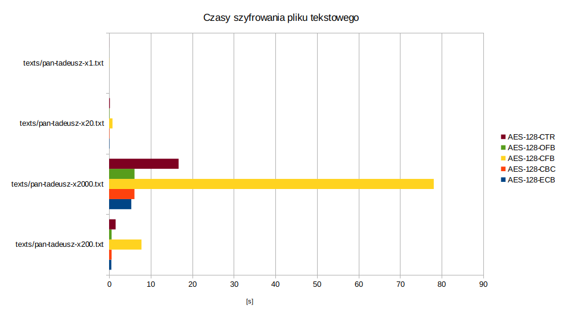
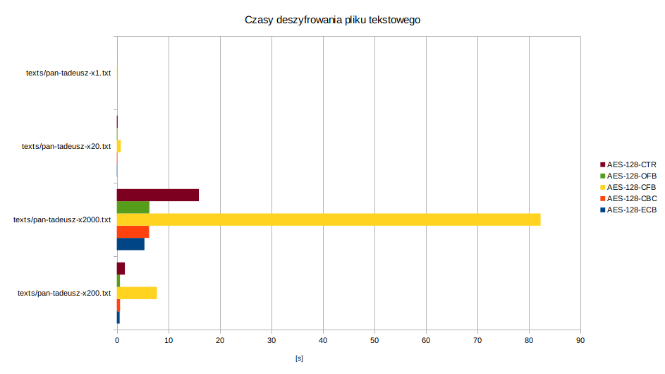

# Testy szybkości

|Plik| Rozmiar  |
|---|:--------:|
|texts/pan-tadeusz-x1.txt|   492K   |
|texts/pan-tadeusz-x20.txt|   9,5M   |
|texts/pan-tadeusz-x200.txt|   95M    |
|texts/pan-tadeusz-x2000.txt|   942M   |

## Szyfrowanie


| algo        | texts/pan-tadeusz-x200.txt | texts/pan-tadeusz-x2000.txt | texts/pan-tadeusz-x20.txt | texts/pan-tadeusz-x1.txt |
|-------------|----------------------------|-----------------------------|---------------------------|--------------------------|
| AES-128-ECB | 0.5423393249511719s        | 5.335513114929199s          | 0.08556270599365234s      | 0.00409698486328125s     |
| AES-128-CBC | 0.6105117797851562s        | 6.098082780838013s          | 0.09098601341247559s      | 0.004996538162231445s    |
| AES-128-CFB | 7.7905592918396s           | 78.09991574287415s          | 0.814338207244873s        | 0.04111170768737793s     |
| AES-128-OFB | 0.6066484451293945s        | 6.111303091049194s          | 0.09192371368408203s      | 0.0052831172943115234s   |
| AES-128-CTR | 1.564948320388794s         | 16.72139000892639s          | 0.18229269981384277s      | 0.012053251266479492s    |

# Deszyfrowanie


| algo        | texts/pan-tadeusz-x200.txt | texts/pan-tadeusz-x2000.txt | texts/pan-tadeusz-x20.txt | texts/pan-tadeusz-x1.txt |
|-------------|----------------------------|-----------------------------|---------------------------|--------------------------|
| AES-128-ECB | 0,5488913059234619s        | 5,370697259902954s          | 0,04987931251525879s      | 0,002453327178955078s    |
| AES-128-CBC | 0,6312170028686523s        | 6,2742674350738525s         | 0,059128761291503906s     | 0,002940654754638672s    |
| AES-128-CFB | 7,788592100143433s         | 82,31377649307251s          | 0,7813680171966553s       | 0,039630889892578125s    |
| AES-128-OFB | 0,6162829399108887s        | 6,336484909057617s          | 0,059990882873535156s     | 0,0028340816497802734s   |
| AES-128-CTR | 1,5615899562835693s        | 15,940932512283325s         | 0,15744352340698242s      | 0,008603572845458984s    |


Czas szyfrowania plików jest liniowy. CFB jest o wyraźnie wolniejszy niż pozostałe tryby blokowe, które posiadają podobną charakterystykę.

# Anomalie
## AES-EBC
### Usunąć cały blok
Po prostu jest usuwany blok tekstu jawnego.

```bash
./diff.sh decrypted/same_byte-aes-ecb_delete_block.bin
```
```diff
6161 6161 6161 6161 6161 6161 6161 6161 aaaaaaaaaaaaaaaa        6161 6161 6161 6161 6161 6161 6161 6161 aaaaaaaaaaaaaaaa
6161 6161 6161 6161 6161 6161 6161 6161 aaaaaaaaaaaaaaaa        6161 6161 6161 6161 6161 6161 6161 6161 aaaaaaaaaaaaaaaa
6161 6161 6161 6161 6161 6161 6161 6161 aaaaaaaaaaaaaaaa        6161 6161 6161 6161 6161 6161 6161 6161 aaaaaaaaaaaaaaaa
6161 6161 6161 6161 6161 6161 6161 6161 aaaaaaaaaaaaaaaa        6161 6161 6161 6161 6161 6161 6161 6161 aaaaaaaaaaaaaaaa
6161 6161 6161 6161 6161 6161 6161 6161 aaaaaaaaaaaaaaaa     <
```
```bash
./diff.sh decrypted/alphabet-aes-ecb_delete_block.bin
```
```diff
6162 6364 6566 6768 696a 6b6c 6d6e 6f70 abcdefghijklmnop        6162 6364 6566 6768 696a 6b6c 6d6e 6f70 abcdefghijklmnop
7172 7374 7576 7778 797a 6162 6364 6566 qrstuvwxyzabcdef        7172 7374 7576 7778 797a 6162 6364 6566 qrstuvwxyzabcdef
6768 696a 6b6c 6d6e 6f70 7172 7374 7576 ghijklmnopqrstuv     <
7778 797a 6162 6364 6566 6768 696a 6b6c wxyzabcdefghijkl        7778 797a 6162 6364 6566 6768 696a 6b6c wxyzabcdefghijkl
6d6e 6f70 7172 7374 7576 7778 797a 6162 mnopqrstuvwxyzab        6d6e 6f70 7172 7374 7576 7778 797a 6162 mnopqrstuvwxyzab
```


```bash
./diff.sh decrypted/text-aes-ecb_delete_block.bin
```
```diff
 4c69 7477 6f2c 204f 6a63 7a79 7a6e 6f20 Litwo, Ojczyzno         4c69 7477 6f2c 204f 6a63 7a79 7a6e 6f20 Litwo, Ojczyzno
 6d6f 6a61 2120 7479 206a 6573 7465 7320 moja! ty jestes         6d6f 6a61 2120 7479 206a 6573 7465 7320 moja! ty jestes
 6a61 6b20 7a64 726f 7769 6520 496c 6520 jak zdrowie Ile      <
 6369 6520 7472 7a65 6261 2063 656e 6963 cie trzeba cenic        6369 6520 7472 7a65 6261 2063 656e 6963 cie trzeba cenic
 2c20 7465 6e20 7479 6c6b 6f20 7369 6520 , ten tylko sie         2c20 7465 6e20 7479 6c6b 6f20 7369 6520 , ten tylko sie
```

### Powielić cały blok
Został dodany nowy blok w wiadomosci janwej.
```bash
 ./diff.sh decrypted/alphabet-aes-ecb_duplicate_block.bin
```
```diff
 6162 6364 6566 6768 696a 6b6c 6d6e 6f70 abcdefghijklmnop        6162 6364 6566 6768 696a 6b6c 6d6e 6f70 abcdefghijklmnop
 7172 7374 7576 7778 797a 6162 6364 6566 qrstuvwxyzabcdef        7172 7374 7576 7778 797a 6162 6364 6566 qrstuvwxyzabcdef
 6768 696a 6b6c 6d6e 6f70 7172 7374 7576 ghijklmnopqrstuv        6768 696a 6b6c 6d6e 6f70 7172 7374 7576 ghijklmnopqrstuv
                                                              >  6768 696a 6b6c 6d6e 6f70 7172 7374 7576 ghijklmnopqrstuv
 7778 797a 6162 6364 6566 6768 696a 6b6c wxyzabcdefghijkl        7778 797a 6162 6364 6566 6768 696a 6b6c wxyzabcdefghijkl
 6d6e 6f70 7172 7374 7576 7778 797a 6162 mnopqrstuvwxyzab        6d6e 6f70 7172 7374 7576 7778 797a 6162 mnopqrstuvwxyzab
```
```bash
 ./diff.sh decrypted/same_byte-aes-ecb_duplicate_block.bin
```
```diff
 6161 6161 6161 6161 6161 6161 6161 6161 aaaaaaaaaaaaaaaa        6161 6161 6161 6161 6161 6161 6161 6161 aaaaaaaaaaaaaaaa
 6161 6161 6161 6161 6161 6161 6161 6161 aaaaaaaaaaaaaaaa        6161 6161 6161 6161 6161 6161 6161 6161 aaaaaaaaaaaaaaaa
 6161 6161 6161 6161 6161 6161 6161 6161 aaaaaaaaaaaaaaaa        6161 6161 6161 6161 6161 6161 6161 6161 aaaaaaaaaaaaaaaa
 6161 6161 6161 6161 6161 6161 6161 6161 aaaaaaaaaaaaaaaa        6161 6161 6161 6161 6161 6161 6161 6161 aaaaaaaaaaaaaaaa
 6161 6161 6161 6161 6161 6161 6161 6161 aaaaaaaaaaaaaaaa        6161 6161 6161 6161 6161 6161 6161 6161 aaaaaaaaaaaaaaaa
                                                              >  6161 6161 6161 6161 6161 6161 6161 6161 aaaaaaaaaaaaaaaa
```
```bash
 ./diff.sh decrypted/text-aes-ecb_duplicate_block.bin
```
```diff
 4c69 7477 6f2c 204f 6a63 7a79 7a6e 6f20 Litwo, Ojczyzno         4c69 7477 6f2c 204f 6a63 7a79 7a6e 6f20 Litwo, Ojczyzno
 6d6f 6a61 2120 7479 206a 6573 7465 7320 moja! ty jestes         6d6f 6a61 2120 7479 206a 6573 7465 7320 moja! ty jestes
 6a61 6b20 7a64 726f 7769 6520 496c 6520 jak zdrowie Ile         6a61 6b20 7a64 726f 7769 6520 496c 6520 jak zdrowie Ile
                                                              >  6a61 6b20 7a64 726f 7769 6520 496c 6520 jak zdrowie Ile
 6369 6520 7472 7a65 6261 2063 656e 6963 cie trzeba cenic        6369 6520 7472 7a65 6261 2063 656e 6963 cie trzeba cenic
 2c20 7465 6e20 7479 6c6b 6f20 7369 6520 , ten tylko sie         2c20 7465 6e20 7479 6c6b 6f20 7369 6520 , ten tylko sie
```                                            >  6161 6161 6161 6161 6161 6161 6161 6161 aaaaaaaaaaaaaaaa
```

### Zamienić bloki miejscami
Bloki w jawnej wiadomości zostały zamienione miejscami
```bash
 ./diff.sh decrypted/alphabet-aes-ecb_block_swap.bin
```
```diff
 6162 6364 6566 6768 696a 6b6c 6d6e 6f70 abcdefghijklmnop        6162 6364 6566 6768 696a 6b6c 6d6e 6f70 abcdefghijklmnop
 7172 7374 7576 7778 797a 6162 6364 6566 qrstuvwxyzabcdef        7172 7374 7576 7778 797a 6162 6364 6566 qrstuvwxyzabcdef
 6768 696a 6b6c 6d6e 6f70 7172 7374 7576 ghijklmnopqrstuv     <
 7778 797a 6162 6364 6566 6768 696a 6b6c wxyzabcdefghijkl        7778 797a 6162 6364 6566 6768 696a 6b6c wxyzabcdefghijkl
                                                              >  6768 696a 6b6c 6d6e 6f70 7172 7374 7576 ghijklmnopqrstuv
 6d6e 6f70 7172 7374 7576 7778 797a 6162 mnopqrstuvwxyzab        6d6e 6f70 7172 7374 7576 7778 797a 6162 mnopqrstuvwxyzab
```
```bash
 ./diff.sh decrypted/same_byte-aes-ecb_block_swap.bin
```
```diff
 6161 6161 6161 6161 6161 6161 6161 6161 aaaaaaaaaaaaaaaa        6161 6161 6161 6161 6161 6161 6161 6161 aaaaaaaaaaaaaaaa
 6161 6161 6161 6161 6161 6161 6161 6161 aaaaaaaaaaaaaaaa        6161 6161 6161 6161 6161 6161 6161 6161 aaaaaaaaaaaaaaaa
 6161 6161 6161 6161 6161 6161 6161 6161 aaaaaaaaaaaaaaaa        6161 6161 6161 6161 6161 6161 6161 6161 aaaaaaaaaaaaaaaa
 6161 6161 6161 6161 6161 6161 6161 6161 aaaaaaaaaaaaaaaa        6161 6161 6161 6161 6161 6161 6161 6161 aaaaaaaaaaaaaaaa
 6161 6161 6161 6161 6161 6161 6161 6161 aaaaaaaaaaaaaaaa        6161 6161 6161 6161 6161 6161 6161 6161 aaaaaaaaaaaaaaaa
```
```bash
 ./diff.sh decrypted/text-aes-ecb_block_swap.bin
```
```diff
 4c69 7477 6f2c 204f 6a63 7a79 7a6e 6f20 Litwo, Ojczyzno         4c69 7477 6f2c 204f 6a63 7a79 7a6e 6f20 Litwo, Ojczyzno
 6d6f 6a61 2120 7479 206a 6573 7465 7320 moja! ty jestes         6d6f 6a61 2120 7479 206a 6573 7465 7320 moja! ty jestes
 6a61 6b20 7a64 726f 7769 6520 496c 6520 jak zdrowie Ile      <
 6369 6520 7472 7a65 6261 2063 656e 6963 cie trzeba cenic        6369 6520 7472 7a65 6261 2063 656e 6963 cie trzeba cenic
                                                              >  6a61 6b20 7a64 726f 7769 6520 496c 6520 jak zdrowie Ile
 2c20 7465 6e20 7479 6c6b 6f20 7369 6520 , ten tylko sie         2c20 7465 6e20 7479 6c6b 6f20 7369 6520 , ten tylko sie
```

### Dodać zupełnie nowy blok szyfrogramu
Dodany losowy blok deszyfruje się na losowe bajty.
```bash
 ./diff.sh decrypted/alphabet-aes-ecb_add_random_block.bin
```
```diff
 6162 6364 6566 6768 696a 6b6c 6d6e 6f70 abcdefghijklmnop        6162 6364 6566 6768 696a 6b6c 6d6e 6f70 abcdefghijklmnop
 7172 7374 7576 7778 797a 6162 6364 6566 qrstuvwxyzabcdef        7172 7374 7576 7778 797a 6162 6364 6566 qrstuvwxyzabcdef
                                                              >  94a1 b644 7d17 1239 4f49 8b58 bc89 9134 ...D}..9OI.X...4
 6768 696a 6b6c 6d6e 6f70 7172 7374 7576 ghijklmnopqrstuv        6768 696a 6b6c 6d6e 6f70 7172 7374 7576 ghijklmnopqrstuv
 7778 797a 6162 6364 6566 6768 696a 6b6c wxyzabcdefghijkl        7778 797a 6162 6364 6566 6768 696a 6b6c wxyzabcdefghijkl
 6d6e 6f70 7172 7374 7576 7778 797a 6162 mnopqrstuvwxyzab        6d6e 6f70 7172 7374 7576 7778 797a 6162 mnopqrstuvwxyzab
```
```bash
 ./diff.sh decrypted/same_byte-aes-ecb_add_random_block.bin
```
```diff
 6161 6161 6161 6161 6161 6161 6161 6161 aaaaaaaaaaaaaaaa        6161 6161 6161 6161 6161 6161 6161 6161 aaaaaaaaaaaaaaaa
 6161 6161 6161 6161 6161 6161 6161 6161 aaaaaaaaaaaaaaaa        6161 6161 6161 6161 6161 6161 6161 6161 aaaaaaaaaaaaaaaa
                                                              >  49a5 a23d 5fb5 5993 2ebb 84c7 e4c8 5bf2 I..=_.Y.......[.
 6161 6161 6161 6161 6161 6161 6161 6161 aaaaaaaaaaaaaaaa        6161 6161 6161 6161 6161 6161 6161 6161 aaaaaaaaaaaaaaaa
 6161 6161 6161 6161 6161 6161 6161 6161 aaaaaaaaaaaaaaaa        6161 6161 6161 6161 6161 6161 6161 6161 aaaaaaaaaaaaaaaa
 6161 6161 6161 6161 6161 6161 6161 6161 aaaaaaaaaaaaaaaa        6161 6161 6161 6161 6161 6161 6161 6161 aaaaaaaaaaaaaaaa
```
```bash
 ./diff.sh decrypted/text-aes-ecb_add_random_block.bin
```
```diff
 4c69 7477 6f2c 204f 6a63 7a79 7a6e 6f20 Litwo, Ojczyzno         4c69 7477 6f2c 204f 6a63 7a79 7a6e 6f20 Litwo, Ojczyzno
 6d6f 6a61 2120 7479 206a 6573 7465 7320 moja! ty jestes         6d6f 6a61 2120 7479 206a 6573 7465 7320 moja! ty jestes
                                                              >  c04b 3c8e 4f91 8447 908f dc3d e170 6f8f .K<.O..G...=.po.
 6a61 6b20 7a64 726f 7769 6520 496c 6520 jak zdrowie Ile         6a61 6b20 7a64 726f 7769 6520 496c 6520 jak zdrowie Ile
 6369 6520 7472 7a65 6261 2063 656e 6963 cie trzeba cenic        6369 6520 7472 7a65 6261 2063 656e 6963 cie trzeba cenic
 2c20 7465 6e20 7479 6c6b 6f20 7369 6520 , ten tylko sie         2c20 7465 6e20 7479 6c6b 6f20 7369 6520 , ten tylko sie
```

### Zmienić wartość jednego bitu/bajtu w bloku
Część bajtów została zniekształcona, część (zwłaszcza w pliku text.bin) bajtów została taka sama jak w oryginalnej wiadomości.
```bash
 ./diff.sh decrypted/alphabet-aes-ecb_modify_one_byte.bin
```
```diff
 01100001 01100010 01100011 01100100 01100101 01100110 abcdef    01100001 01100010 01100011 01100100 01100101 01100110 abcdef
 01100111 01101000 01101001 01101010 01101011 01101100 ghijkl    01100111 01101000 01101001 01101010 01101011 01101100 ghijkl
 01101101 01101110 01101111 01110000 01110001 01110010 mnopqr    01101101 01101110 01101111 01110000 01110001 01110010 mnopqr
 01110011 01110100 01110101 01110110 01110111 01111000 stuvwx    01110011 01110100 01110101 01110110 01110111 01111000 stuvwx
 01111001 01111010 01100001 01100010 01100011 01100100 yzabcd    01111001 01111010 01100001 01100010 01100011 01100100 yzabcd
 01100101 01100110 01100111 01101000 01101001 01101010 efghij    01100101 01100110 01100111 01101000 01101001 01101010 efghij
 01101011 01101100 01101101 01101110 01101111 01110000 klmnop    01101011 01101100 01101101 01101110 01101111 01110000 klmnop
 01110001 01110010 01110011 01110100 01110101 01110110 qrstuv    01110001 01110010 01110011 01110100 01110101 01110110 qrstuv
 01110111 01111000 01111001 01111010 01100001 01100010 wxyzab |  10000111 01100111 11000101 00000101 10000010 01011000 .g...X
 01100011 01100100 01100101 01100110 01100111 01101000 cdefgh |  01101001 00101001 11011101 01111000 11011110 00101101 i).x.-
 01101001 01101010 01101011 01101100 01101101 01101110 ijklmn |  11101111 00111101 11100001 01110110 01101101 01101110 .=.vmn
 01101111 01110000 01110001 01110010 01110011 01110100 opqrst    01101111 01110000 01110001 01110010 01110011 01110100 opqrst
 01110101 01110110 01110111 01111000 01111001 01111010 uvwxyz    01110101 01110110 01110111 01111000 01111001 01111010 uvwxyz
 01100001 01100010 ab                                            01100001 01100010 ab
```
```bash
 ./diff.sh decrypted/same_byte-aes-ecb_modify_one_byte.bin
```
```diff
 01100001 01100001 01100001 01100001 01100001 01100001 aaaaaa    01100001 01100001 01100001 01100001 01100001 01100001 aaaaaa
 01100001 01100001 01100001 01100001 01100001 01100001 aaaaaa    01100001 01100001 01100001 01100001 01100001 01100001 aaaaaa
 01100001 01100001 01100001 01100001 01100001 01100001 aaaaaa    01100001 01100001 01100001 01100001 01100001 01100001 aaaaaa
 01100001 01100001 01100001 01100001 01100001 01100001 aaaaaa    01100001 01100001 01100001 01100001 01100001 01100001 aaaaaa
 01100001 01100001 01100001 01100001 01100001 01100001 aaaaaa    01100001 01100001 01100001 01100001 01100001 01100001 aaaaaa
 01100001 01100001 01100001 01100001 01100001 01100001 aaaaaa |  01100001 01100001 00011010 10101110 11111111 01000111 aa...G
 01100001 01100001 01100001 01100001 01100001 01100001 aaaaaa |  00000000 11101001 10100101 10000100 00010010 11100110 ......
 01100001 01100001 01100001 01100001 01100001 01100001 aaaaaa |  10100000 11101000 10001100 10000001 10100001 00101000 .....(
 01100001 01100001 01100001 01100001 01100001 01100001 aaaaaa    01100001 01100001 01100001 01100001 01100001 01100001 aaaaaa
 01100001 01100001 01100001 01100001 01100001 01100001 aaaaaa    01100001 01100001 01100001 01100001 01100001 01100001 aaaaaa
 01100001 01100001 01100001 01100001 01100001 01100001 aaaaaa    01100001 01100001 01100001 01100001 01100001 01100001 aaaaaa
 01100001 01100001 01100001 01100001 01100001 01100001 aaaaaa    01100001 01100001 01100001 01100001 01100001 01100001 aaaaaa
 01100001 01100001 01100001 01100001 01100001 01100001 aaaaaa    01100001 01100001 01100001 01100001 01100001 01100001 aaaaaa
 01100001 01100001 aa                                            01100001 01100001 aa
```
```bash
 ./diff.sh decrypted/text-aes-ecb_modify_one_byte.bin
```
```diff
 01001100 01101001 01110100 01110111 01101111 00101100 Litwo,    01001100 01101001 01110100 01110111 01101111 00101100 Litwo,
 00100000 01001111 01101010 01100011 01111010 01111001 Ojczy     00100000 01001111 01101010 01100011 01111010 01111001 Ojczy
 01111010 01101110 01101111 00100000 01101101 01101111 zno mo |  01111010 01101110 01101111 00100000 01110001 10111000 zno q.
 01101010 01100001 00100001 00100000 01110100 01111001 ja! ty |  00010100 00111011 00101010 01001101 00000011 01101010 .;*M.j
 00100000 01101010 01100101 01110011 01110100 01100101 jeste  |  10111100 10010111 10101010 10111101 10111101 10101000 ......
 01110011 00100000 01101010 01100001 01101011 00100000 s jak  |  11101000 00001010 01101010 01100001 01101011 00100000 ..jak
 01111010 01100100 01110010 01101111 01110111 01101001 zdrowi    01111010 01100100 01110010 01101111 01110111 01101001 zdrowi
 01100101 00100000 01001001 01101100 01100101 00100000 e Ile     01100101 00100000 01001001 01101100 01100101 00100000 e Ile
 01100011 01101001 01100101 00100000 01110100 01110010 cie tr    01100011 01101001 01100101 00100000 01110100 01110010 cie tr
 01111010 01100101 01100010 01100001 00100000 01100011 zeba c    01111010 01100101 01100010 01100001 00100000 01100011 zeba c
 01100101 01101110 01101001 01100011 00101100 00100000 enic,     01100101 01101110 01101001 01100011 00101100 00100000 enic,
 01110100 01100101 01101110 00100000 01110100 01111001 ten ty    01110100 01100101 01101110 00100000 01110100 01111001 ten ty
 01101100 01101011 01101111 00100000 01110011 01101001 lko si    01101100 01101011 01101111 00100000 01110011 01101001 lko si
 01100101 00100000 e                                             01100101 00100000 e
```

### Zamiana miejscami bajtów wewnątrz bloku
Zmiana miejscami bajtów wewnątrz bloku praktycznie w całości zmienia deszyfrowaną wiadomość.
```bash
 ./diff.sh decrypted/alphabet-aes-ecb_swap_bytes_in_block.bin
```
```diff
 01100001 01100010 01100011 01100100 01100101 01100110 abcdef    01100001 01100010 01100011 01100100 01100101 01100110 abcdef
 01100111 01101000 01101001 01101010 01101011 01101100 ghijkl    01100111 01101000 01101001 01101010 01101011 01101100 ghijkl
 01101101 01101110 01101111 01110000 01110001 01110010 mnopqr    01101101 01101110 01101111 01110000 01110001 01110010 mnopqr
 01110011 01110100 01110101 01110110 01110111 01111000 stuvwx    01110011 01110100 01110101 01110110 01110111 01111000 stuvwx
 01111001 01111010 01100001 01100010 01100011 01100100 yzabcd    01111001 01111010 01100001 01100010 01100011 01100100 yzabcd
 01100101 01100110 01100111 01101000 01101001 01101010 efghij    01100101 01100110 01100111 01101000 01101001 01101010 efghij
 01101011 01101100 01101101 01101110 01101111 01110000 klmnop    01101011 01101100 01101101 01101110 01101111 01110000 klmnop
 01110001 01110010 01110011 01110100 01110101 01110110 qrstuv    01110001 01110010 01110011 01110100 01110101 01110110 qrstuv
 01110111 01111000 01111001 01111010 01100001 01100010 wxyzab |  10110101 10010100 00000110 11101101 11100010 10110101 ......
 01100011 01100100 01100101 01100110 01100111 01101000 cdefgh |  11000110 00111111 00111111 01000110 01110000 10000101 .??Fp.
 01101001 01101010 01101011 01101100 01101101 01101110 ijklmn |  01001110 10010110 01110110 10100101 01101101 01101110 N.v.mn
 01101111 01110000 01110001 01110010 01110011 01110100 opqrst    01101111 01110000 01110001 01110010 01110011 01110100 opqrst
 01110101 01110110 01110111 01111000 01111001 01111010 uvwxyz    01110101 01110110 01110111 01111000 01111001 01111010 uvwxyz
 01100001 01100010 ab                                            01100001 01100010 ab
```
```bash
 ./diff.sh decrypted/same_byte-aes-ecb_swap_bytes_in_block.bin
```
```diff
 01100001 01100001 01100001 01100001 01100001 01100001 aaaaaa    01100001 01100001 01100001 01100001 01100001 01100001 aaaaaa
 01100001 01100001 01100001 01100001 01100001 01100001 aaaaaa    01100001 01100001 01100001 01100001 01100001 01100001 aaaaaa
 01100001 01100001 01100001 01100001 01100001 01100001 aaaaaa    01100001 01100001 01100001 01100001 01100001 01100001 aaaaaa
 01100001 01100001 01100001 01100001 01100001 01100001 aaaaaa    01100001 01100001 01100001 01100001 01100001 01100001 aaaaaa
 01100001 01100001 01100001 01100001 01100001 01100001 aaaaaa    01100001 01100001 01100001 01100001 01100001 01100001 aaaaaa
 01100001 01100001 01100001 01100001 01100001 01100001 aaaaaa    01100001 01100001 01100001 01100001 01100001 01100001 aaaaaa
 01100001 01100001 01100001 01100001 01100001 01100001 aaaaaa    01100001 01100001 01100001 01100001 01100001 01100001 aaaaaa
 01100001 01100001 01100001 01100001 01100001 01100001 aaaaaa    01100001 01100001 01100001 01100001 01100001 01100001 aaaaaa
 01100001 01100001 01100001 01100001 01100001 01100001 aaaaaa |  00110101 00010111 00111101 10111000 11110000 01010001 5.=..Q
 01100001 01100001 01100001 01100001 01100001 01100001 aaaaaa |  11111111 01001000 01111101 00001110 11010110 10010101 .H}...
 01100001 01100001 01100001 01100001 01100001 01100001 aaaaaa |  11010111 10010011 11001110 10011001 01100001 01100001 ....aa
 01100001 01100001 01100001 01100001 01100001 01100001 aaaaaa    01100001 01100001 01100001 01100001 01100001 01100001 aaaaaa
 01100001 01100001 01100001 01100001 01100001 01100001 aaaaaa    01100001 01100001 01100001 01100001 01100001 01100001 aaaaaa
 01100001 01100001 aa                                            01100001 01100001 aa
```
```bash
 ./diff.sh decrypted/text-aes-ecb_swap_bytes_in_block.bin
```
```diff
 01001100 01101001 01110100 01110111 01101111 00101100 Litwo,    01001100 01101001 01110100 01110111 01101111 00101100 Litwo,
 00100000 01001111 01101010 01100011 01111010 01111001 Ojczy     00100000 01001111 01101010 01100011 01111010 01111001 Ojczy
 01111010 01101110 01101111 00100000 01101101 01101111 zno mo    01111010 01101110 01101111 00100000 01101101 01101111 zno mo
 01101010 01100001 00100001 00100000 01110100 01111001 ja! ty    01101010 01100001 00100001 00100000 01110100 01111001 ja! ty
 00100000 01101010 01100101 01110011 01110100 01100101 jeste     00100000 01101010 01100101 01110011 01110100 01100101 jeste
 01110011 00100000 01101010 01100001 01101011 00100000 s jak     01110011 00100000 01101010 01100001 01101011 00100000 s jak
 01111010 01100100 01110010 01101111 01110111 01101001 zdrowi    01111010 01100100 01110010 01101111 01110111 01101001 zdrowi
 01100101 00100000 01001001 01101100 01100101 00100000 e Ile     01100101 00100000 01001001 01101100 01100101 00100000 e Ile
 01100011 01101001 01100101 00100000 01110100 01110010 cie tr |  00111111 00100100 01101101 11011000 10011010 01100010 ?$m..b
 01111010 01100101 01100010 01100001 00100000 01100011 zeba c |  01011101 00110001 00111010 00110101 10111100 11101101 ]1:5..
 01100101 01101110 01101001 01100011 00101100 00100000 enic,  |  00101101 11111111 00111010 01011011 00101100 00100000 -.:[,
 01110100 01100101 01101110 00100000 01110100 01111001 ten ty    01110100 01100101 01101110 00100000 01110100 01111001 ten ty
 01101100 01101011 01101111 00100000 01110011 01101001 lko si    01101100 01101011 01101111 00100000 01110011 01101001 lko si
 01100101 00100000 e                                             01100101 00100000 e
```

### Usunąć fragment bloku
Szyfrogram nie daje się odszyfrować.

## AES-CBC
### Usunąć cały blok
Po usunięciu bloku dalsze bloki zostają uszkodzone z uwagi na specyfikę CBC (xor z poprzednim blokiem).
```bash
 ./diff.sh decrypted/alphabet-aes-cbc_delete_block.bin
```
```diff
 6162 6364 6566 6768 696a 6b6c 6d6e 6f70 abcdefghijklmnop        6162 6364 6566 6768 696a 6b6c 6d6e 6f70 abcdefghijklmnop
 7172 7374 7576 7778 797a 6162 6364 6566 qrstuvwxyzabcdef        7172 7374 7576 7778 797a 6162 6364 6566 qrstuvwxyzabcdef
 6768 696a 6b6c 6d6e 6f70 7172 7374 7576 ghijklmnopqrstuv     |  c179 a606 3b36 99c0 9fd8 1baa ac34 513f .y..;6.......4Q?
 7778 797a 6162 6364 6566 6768 696a 6b6c wxyzabcdefghijkl     <
 6d6e 6f70 7172 7374 7576 7778 797a 6162 mnopqrstuvwxyzab        6d6e 6f70 7172 7374 7576 7778 797a 6162 mnopqrstuvwxyzab
```
```bash
 ./diff.sh decrypted/same_byte-aes-cbc_delete_block.bin
```
```diff
 6161 6161 6161 6161 6161 6161 6161 6161 aaaaaaaaaaaaaaaa        6161 6161 6161 6161 6161 6161 6161 6161 aaaaaaaaaaaaaaaa
 6161 6161 6161 6161 6161 6161 6161 6161 aaaaaaaaaaaaaaaa        6161 6161 6161 6161 6161 6161 6161 6161 aaaaaaaaaaaaaaaa
 6161 6161 6161 6161 6161 6161 6161 6161 aaaaaaaaaaaaaaaa     |  70df dd01 8c57 3b44 e239 7fcf 5653 7a45 p....W;D.9..VSzE
 6161 6161 6161 6161 6161 6161 6161 6161 aaaaaaaaaaaaaaaa     <
 6161 6161 6161 6161 6161 6161 6161 6161 aaaaaaaaaaaaaaaa        6161 6161 6161 6161 6161 6161 6161 6161 aaaaaaaaaaaaaaaa
```
```bash
 ./diff.sh decrypted/text-aes-cbc_delete_block.bin
```
```diff
 4c69 7477 6f2c 204f 6a63 7a79 7a6e 6f20 Litwo, Ojczyzno         4c69 7477 6f2c 204f 6a63 7a79 7a6e 6f20 Litwo, Ojczyzno
 6d6f 6a61 2120 7479 206a 6573 7465 7320 moja! ty jestes         6d6f 6a61 2120 7479 206a 6573 7465 7320 moja! ty jestes
 6a61 6b20 7a64 726f 7769 6520 496c 6520 jak zdrowie Ile      |  5a87 6072 c41a aaed 494a cedf f36c 9e23 Z.`r....IJ...l.#
 6369 6520 7472 7a65 6261 2063 656e 6963 cie trzeba cenic     <
 2c20 7465 6e20 7479 6c6b 6f20 7369 6520 , ten tylko sie         2c20 7465 6e20 7479 6c6b 6f20 7369 6520 , ten tylko sie
```

### Powielić cały blok
Odszyfrowany zduplikowany blok zostaje zniekształcony, ponieważ xoruje się ze swoją poprzednią kopią. Wszystkie inne bloki są poprawne.
```bash
 ./diff.sh decrypted/alphabet-aes-cbc_duplicate_block.bin
```
```diff
 6162 6364 6566 6768 696a 6b6c 6d6e 6f70 abcdefghijklmnop        6162 6364 6566 6768 696a 6b6c 6d6e 6f70 abcdefghijklmnop
 7172 7374 7576 7778 797a 6162 6364 6566 qrstuvwxyzabcdef        7172 7374 7576 7778 797a 6162 6364 6566 qrstuvwxyzabcdef
 6768 696a 6b6c 6d6e 6f70 7172 7374 7576 ghijklmnopqrstuv        6768 696a 6b6c 6d6e 6f70 7172 7374 7576 ghijklmnopqrstuv
                                                              >  d169 b616 3138 97ca 95ce 0db0 b62a 4f25 .i..18.......*O%
 7778 797a 6162 6364 6566 6768 696a 6b6c wxyzabcdefghijkl        7778 797a 6162 6364 6566 6768 696a 6b6c wxyzabcdefghijkl
 6d6e 6f70 7172 7374 7576 7778 797a 6162 mnopqrstuvwxyzab        6d6e 6f70 7172 7374 7576 7778 797a 6162 mnopqrstuvwxyzab
```
```bash
 ./diff.sh decrypted/same_byte-aes-cbc_duplicate_block.bin
```
```diff
 6161 6161 6161 6161 6161 6161 6161 6161 aaaaaaaaaaaaaaaa        6161 6161 6161 6161 6161 6161 6161 6161 aaaaaaaaaaaaaaaa
 6161 6161 6161 6161 6161 6161 6161 6161 aaaaaaaaaaaaaaaa        6161 6161 6161 6161 6161 6161 6161 6161 aaaaaaaaaaaaaaaa
 6161 6161 6161 6161 6161 6161 6161 6161 aaaaaaaaaaaaaaaa        6161 6161 6161 6161 6161 6161 6161 6161 aaaaaaaaaaaaaaaa
                                                              >  70df dd01 8c57 3b44 e239 7fcf 5653 7a45 p....W;D.9..VSzE
 6161 6161 6161 6161 6161 6161 6161 6161 aaaaaaaaaaaaaaaa        6161 6161 6161 6161 6161 6161 6161 6161 aaaaaaaaaaaaaaaa
 6161 6161 6161 6161 6161 6161 6161 6161 aaaaaaaaaaaaaaaa        6161 6161 6161 6161 6161 6161 6161 6161 aaaaaaaaaaaaaaaa
```
```bash
 ./diff.sh decrypted/text-aes-cbc_duplicate_block.bin
```
```diff
 4c69 7477 6f2c 204f 6a63 7a79 7a6e 6f20 Litwo, Ojczyzno         4c69 7477 6f2c 204f 6a63 7a79 7a6e 6f20 Litwo, Ojczyzno
 6d6f 6a61 2120 7479 206a 6573 7465 7320 moja! ty jestes         6d6f 6a61 2120 7479 206a 6573 7465 7320 moja! ty jestes
 6a61 6b20 7a64 726f 7769 6520 496c 6520 jak zdrowie Ile         6a61 6b20 7a64 726f 7769 6520 496c 6520 jak zdrowie Ile
                                                              >  538f 6e72 ca0c a2e7 5c42 8b9c df6e 9260 S.nr....\B...n.`
 6369 6520 7472 7a65 6261 2063 656e 6963 cie trzeba cenic        6369 6520 7472 7a65 6261 2063 656e 6963 cie trzeba cenic
 2c20 7465 6e20 7479 6c6b 6f20 7369 6520 , ten tylko sie         2c20 7465 6e20 7479 6c6b 6f20 7369 6520 , ten tylko sie
```

### Zamienić bloki miejscami
Wszystkie bloki po pierwszym zamienionym bloku zostają nieprawidłowo odszyfrowane z uwagi na zupełnie inny blok do xorowania.
```bash
 ./diff.sh decrypted/alphabet-aes-cbc_block_swap.bin
```
```diff
 6162 6364 6566 6768 696a 6b6c 6d6e 6f70 abcdefghijklmnop        6162 6364 6566 6768 696a 6b6c 6d6e 6f70 abcdefghijklmnop
 7172 7374 7576 7778 797a 6162 6364 6566 qrstuvwxyzabcdef        7172 7374 7576 7778 797a 6162 6364 6566 qrstuvwxyzabcdef
 6768 696a 6b6c 6d6e 6f70 7172 7374 7576 ghijklmnopqrstuv     |  c179 a606 3b36 99c0 9fd8 1baa ac34 513f .y..;6.......4Q?
 7778 797a 6162 6364 6566 6768 696a 6b6c wxyzabcdefghijkl     |  16a9 a3b0 1143 87d5 e5a9 222c d1ef 94a0 .....C....",....
 6d6e 6f70 7172 7374 7576 7778 797a 6162 mnopqrstuvwxyzab     |  aaae 7ad6 5109 636b 0511 58e4 1ebf bae7 ..z.Q.ck..X.....
```
```bash
 ./diff.sh decrypted/same_byte-aes-cbc_block_swap.bin
```
```diff
 6161 6161 6161 6161 6161 6161 6161 6161 aaaaaaaaaaaaaaaa        6161 6161 6161 6161 6161 6161 6161 6161 aaaaaaaaaaaaaaaa
 6161 6161 6161 6161 6161 6161 6161 6161 aaaaaaaaaaaaaaaa        6161 6161 6161 6161 6161 6161 6161 6161 aaaaaaaaaaaaaaaa
 6161 6161 6161 6161 6161 6161 6161 6161 aaaaaaaaaaaaaaaa     |  70df dd01 8c57 3b44 e239 7fcf 5653 7a45 p....W;D.9..VSzE
 6161 6161 6161 6161 6161 6161 6161 6161 aaaaaaaaaaaaaaaa     |  d40c f3c4 1e46 1e62 92cb dbb9 3414 1643 .....F.b....4..C
 6161 6161 6161 6161 6161 6161 6161 6161 aaaaaaaaaaaaaaaa     |  c5b2 4fa4 f370 4447 1193 c517 0326 0d67 ..O..pDG.....&.g
```
```bash
 ./diff.sh decrypted/text-aes-cbc_block_swap.bin
```
```diff
 4c69 7477 6f2c 204f 6a63 7a79 7a6e 6f20 Litwo, Ojczyzno         4c69 7477 6f2c 204f 6a63 7a79 7a6e 6f20 Litwo, Ojczyzno
 6d6f 6a61 2120 7479 206a 6573 7465 7320 moja! ty jestes         6d6f 6a61 2120 7479 206a 6573 7465 7320 moja! ty jestes
 6a61 6b20 7a64 726f 7769 6520 496c 6520 jak zdrowie Ile      |  5a87 6072 c41a aaed 494a cedf f36c 9e23 Z.`r....IJ...l.#
 6369 6520 7472 7a65 6261 2063 656e 6963 cie trzeba cenic     |  8952 b829 6f6d 7a80 d777 ca9a 3440 0198 .R.)omz..w..4@..
 2c20 7465 6e20 7479 6c6b 6f20 7369 6520 , ten tylko sie      |  f6fd a23e cb41 ac1e e75e 2e26 9847 f6d8 ...>.A...^.&.G..
```

### Dodać zupełnie nowy blok szyfrogramu
Dodany losowy blok szyfrogramu deszyfruje się do losowych bajtów, kolejny blok jest niepoprawnie deszyfrowany poprzez inny poprzedni blok do xorowania. Następne bloki poprawnie się deszyfrują.
```bash
 ./diff.sh decrypted/alphabet-aes-cbc_add_random_block.bin
```
```diff
 6162 6364 6566 6768 696a 6b6c 6d6e 6f70 abcdefghijklmnop        6162 6364 6566 6768 696a 6b6c 6d6e 6f70 abcdefghijklmnop
 7172 7374 7576 7778 797a 6162 6364 6566 qrstuvwxyzabcdef        7172 7374 7576 7778 797a 6162 6364 6566 qrstuvwxyzabcdef
 6768 696a 6b6c 6d6e 6f70 7172 7374 7576 ghijklmnopqrstuv     |  ee21 2648 6e28 ceb1 1abe 868b a6d6 ec2e .!&Hn(..........
                                                              >  3d6f 258c ea0e b184 e5db f169 a34c 4fcb =o%........i.LO.
 7778 797a 6162 6364 6566 6768 696a 6b6c wxyzabcdefghijkl        7778 797a 6162 6364 6566 6768 696a 6b6c wxyzabcdefghijkl
 6d6e 6f70 7172 7374 7576 7778 797a 6162 mnopqrstuvwxyzab        6d6e 6f70 7172 7374 7576 7778 797a 6162 mnopqrstuvwxyzab
```
```bash
 ./diff.sh decrypted/same_byte-aes-cbc_add_random_block.bin
```
```diff
 6161 6161 6161 6161 6161 6161 6161 6161 aaaaaaaaaaaaaaaa        6161 6161 6161 6161 6161 6161 6161 6161 aaaaaaaaaaaaaaaa
 6161 6161 6161 6161 6161 6161 6161 6161 aaaaaaaaaaaaaaaa        6161 6161 6161 6161 6161 6161 6161 6161 aaaaaaaaaaaaaaaa
 6161 6161 6161 6161 6161 6161 6161 6161 aaaaaaaaaaaaaaaa     |  0d68 1513 7bdd d80b a4df b43f e0d0 29e0 .h..{......?..).
                                                              >  6650 127f f361 8370 c822 f1cd 2f17 50be fP...a.p."../.P.
 6161 6161 6161 6161 6161 6161 6161 6161 aaaaaaaaaaaaaaaa        6161 6161 6161 6161 6161 6161 6161 6161 aaaaaaaaaaaaaaaa
 6161 6161 6161 6161 6161 6161 6161 6161 aaaaaaaaaaaaaaaa        6161 6161 6161 6161 6161 6161 6161 6161 aaaaaaaaaaaaaaaa
```
```bash
 ./diff.sh decrypted/text-aes-cbc_add_random_block.bin
```
```diff
 4c69 7477 6f2c 204f 6a63 7a79 7a6e 6f20 Litwo, Ojczyzno         4c69 7477 6f2c 204f 6a63 7a79 7a6e 6f20 Litwo, Ojczyzno
 6d6f 6a61 2120 7479 206a 6573 7465 7320 moja! ty jestes         6d6f 6a61 2120 7479 206a 6573 7465 7320 moja! ty jestes
 6a61 6b20 7a64 726f 7769 6520 496c 6520 jak zdrowie Ile      |  4c63 bfd8 ef3c 5be6 9753 3129 249f a616 Lc...<[..S1)$...
                                                              >  ac39 82d2 762d 569b c32a 604d 5489 a0ab .9..v-V..*`MT...
 6369 6520 7472 7a65 6261 2063 656e 6963 cie trzeba cenic        6369 6520 7472 7a65 6261 2063 656e 6963 cie trzeba cenic
 2c20 7465 6e20 7479 6c6b 6f20 7369 6520 , ten tylko sie         2c20 7465 6e20 7479 6c6b 6f20 7369 6520 , ten tylko sie
 ```

### Zamienić wartość jednego bitu/bajtu w bloku
Modyfikowany blok zostaje niepoprawnie odszyfrowany oraz następny blok posiada zmieniony jeden bajt.
```bash
 ./diff.sh decrypted/alphabet-aes-cbc_modify_one_byte.bin
```
```diff
 6162 6364 6566 6768 696a 6b6c 6d6e 6f70 abcdefghijklmnop        6162 6364 6566 6768 696a 6b6c 6d6e 6f70 abcdefghijklmnop
 7172 7374 7576 7778 797a 6162 6364 6566 qrstuvwxyzabcdef        7172 7374 7576 7778 797a 6162 6364 6566 qrstuvwxyzabcdef
 6768 696a 6b6c 6d6e 6f70 7172 7374 7576 ghijklmnopqrstuv        6768 696a 6b6c 6d6e 6f70 7172 7374 7576 ghijklmnopqrstuv
 7778 797a 6162 6364 6566 6768 696a 6b6c wxyzabcdefghijkl        7778 797a 6162 6364 6566 6768 696a 6b6c wxyzabcdefghijkl
 6d6e 6f70 7172 7374 7576 7778 797a 6162 mnopqrstuvwxyzab     |  706c 4dae de4e 987c b99c 31f9 84be 5961 plM..N.|..1...Ya
                                                              >  1010 1010 1010 1010 1010 fe10 1010 1010 ................
```
```bash
 ./diff.sh decrypted/same_byte-aes-cbc_modify_one_byte.bin
```
```diff
 6161 6161 6161 6161 6161 6161 6161 6161 aaaaaaaaaaaaaaaa        6161 6161 6161 6161 6161 6161 6161 6161 aaaaaaaaaaaaaaaa
 6161 6161 6161 6161 6161 6161 6161 6161 aaaaaaaaaaaaaaaa     |  139a 7bcb 69a9 bc71 2dd1 0be2 e327 6d39 ..{.i..q-....'m9
 6161 6161 6161 6161 6161 6161 6161 6161 aaaaaaaaaaaaaaaa     |  6161 6161 b261 6161 6161 6161 6161 6161 aaaa.aaaaaaaaaaa
 6161 6161 6161 6161 6161 6161 6161 6161 aaaaaaaaaaaaaaaa        6161 6161 6161 6161 6161 6161 6161 6161 aaaaaaaaaaaaaaaa
 6161 6161 6161 6161 6161 6161 6161 6161 aaaaaaaaaaaaaaaa        6161 6161 6161 6161 6161 6161 6161 6161 aaaaaaaaaaaaaaaa
```
```bash
 ./diff.sh decrypted/text-aes-cbc_modify_one_byte.bin
```
```diff
 4c69 7477 6f2c 204f 6a63 7a79 7a6e 6f20 Litwo, Ojczyzno         4c69 7477 6f2c 204f 6a63 7a79 7a6e 6f20 Litwo, Ojczyzno
 6d6f 6a61 2120 7479 206a 6573 7465 7320 moja! ty jestes         6d6f 6a61 2120 7479 206a 6573 7465 7320 moja! ty jestes
 6a61 6b20 7a64 726f 7769 6520 496c 6520 jak zdrowie Ile      |  e71f 5192 5594 4b81 a74c c17a 49e8 9ab0 ..Q.U.K..L.zI...
 6369 6520 7472 7a65 6261 2063 656e 6963 cie trzeba cenic     |  6369 6520 7472 7a65 623a 2063 656e 6963 cie trzeb: cenic
 2c20 7465 6e20 7479 6c6b 6f20 7369 6520 , ten tylko sie         2c20 7465 6e20 7479 6c6b 6f20 7369 6520 , ten tylko sie
```

### Zamiana miejscami bajtów wewnątrz bloku
Modyfikowany blok zostaje uszkodzony oraz dwa bajty w następnym bloku zostają niepoprawnie xorowane (poprzez zamianę).
```bash
 ./diff.sh decrypted/alphabet-aes-cbc_swap_bytes_in_block.bin
```
```diff
 6162 6364 6566 6768 696a 6b6c 6d6e 6f70 abcdefghijklmnop        6162 6364 6566 6768 696a 6b6c 6d6e 6f70 abcdefghijklmnop
 7172 7374 7576 7778 797a 6162 6364 6566 qrstuvwxyzabcdef        7172 7374 7576 7778 797a 6162 6364 6566 qrstuvwxyzabcdef
 6768 696a 6b6c 6d6e 6f70 7172 7374 7576 ghijklmnopqrstuv        6768 696a 6b6c 6d6e 6f70 7172 7374 7576 ghijklmnopqrstuv
 7778 797a 6162 6364 6566 6768 696a 6b6c wxyzabcdefghijkl     |  3d8e d1df 90cf e803 ab1e 447f 96c4 0a98 =.........D.....
 6d6e 6f70 7172 7374 7576 7778 797a 6162 mnopqrstuvwxyzab     |  6d6e 6f70 7172 585f 7576 7778 797a 6162 mnopqrX_uvwxyzab
```
```bash
 ./diff.sh decrypted/same_byte-aes-cbc_swap_bytes_in_block.bin
```
```diff
 6161 6161 6161 6161 6161 6161 6161 6161 aaaaaaaaaaaaaaaa        6161 6161 6161 6161 6161 6161 6161 6161 aaaaaaaaaaaaaaaa
 6161 6161 6161 6161 6161 6161 6161 6161 aaaaaaaaaaaaaaaa        6161 6161 6161 6161 6161 6161 6161 6161 aaaaaaaaaaaaaaaa
 6161 6161 6161 6161 6161 6161 6161 6161 aaaaaaaaaaaaaaaa        6161 6161 6161 6161 6161 6161 6161 6161 aaaaaaaaaaaaaaaa
 6161 6161 6161 6161 6161 6161 6161 6161 aaaaaaaaaaaaaaaa     |  74ae 03d2 fbe4 4d1f c63b dd62 ea1f c406 t.....M..;.b....
 6161 6161 6161 6161 6161 6161 6161 6161 aaaaaaaaaaaaaaaa     |  6161 6161 6161 d4d4 6161 6161 6161 6161 aaaaaa..aaaaaaaa
```
```bash
 ./diff.sh decrypted/text-aes-cbc_swap_bytes_in_block.bin
```
```diff
 4c69 7477 6f2c 204f 6a63 7a79 7a6e 6f20 Litwo, Ojczyzno         4c69 7477 6f2c 204f 6a63 7a79 7a6e 6f20 Litwo, Ojczyzno
 6d6f 6a61 2120 7479 206a 6573 7465 7320 moja! ty jestes         6d6f 6a61 2120 7479 206a 6573 7465 7320 moja! ty jestes
 6a61 6b20 7a64 726f 7769 6520 496c 6520 jak zdrowie Ile         6a61 6b20 7a64 726f 7769 6520 496c 6520 jak zdrowie Ile
 6369 6520 7472 7a65 6261 2063 656e 6963 cie trzeba cenic     |  bb68 1527 a3dd 4c11 56f9 e2eb f549 e979 .h.'..L.V....I.y
 2c20 7465 6e20 7479 6c6b 6f20 7369 6520 , ten tylko sie      |  2c20 7465 6e20 b9b4 6c6b 6f20 7369 6520 , ten ..lko sie
```

### Usunąć fragment bloku
Szyfrogram nie daje się odszyfrować.

## AES-CTR
###  Usunąć cały blok
Dalsze bloki zostają nieprawidłowo odszyfrowane poprzez przesunięcie licznika.
```bash
 ./diff.sh decrypted/alphabet-aes-ctr_delete_block.bin
```
```diff
 6162 6364 6566 6768 696a 6b6c 6d6e 6f70 abcdefghijklmnop        6162 6364 6566 6768 696a 6b6c 6d6e 6f70 abcdefghijklmnop
 7172 7374 7576 7778 797a 6162 6364 6566 qrstuvwxyzabcdef        7172 7374 7576 7778 797a 6162 6364 6566 qrstuvwxyzabcdef
 6768 696a 6b6c 6d6e 6f70 7172 7374 7576 ghijklmnopqrstuv     |  d4fe df7f 083d 23b6 6073 d4fe ea09 608e .....=#.`s....`.
 7778 797a 6162 6364 6566 6768 696a 6b6c wxyzabcdefghijkl     |  7eec 4388 b4e3 70d8 6f6a 09d0 f5fb 17bd ~.C...p.oj......
 6d6e 6f70 7172 7374 7576 7778 797a 6162 mnopqrstuvwxyzab     |  520e ff60 6403 27e7 a7a6 0b6d 1662 fd7a R..`d.'....m.b.z
```
```bash
 ./diff.sh decrypted/same_byte-aes-ctr_delete_block.bin
```
```diff
 6161 6161 6161 6161 6161 6161 6161 6161 aaaaaaaaaaaaaaaa        6161 6161 6161 6161 6161 6161 6161 6161 aaaaaaaaaaaaaaaa
 6161 6161 6161 6161 6161 6161 6161 6161 aaaaaaaaaaaaaaaa        6161 6161 6161 6161 6161 6161 6161 6161 aaaaaaaaaaaaaaaa
 6161 6161 6161 6161 6161 6161 6161 6161 aaaaaaaaaaaaaaaa     |  c2e7 c764 083e 21b3 6474 d2f7 e202 6a83 ...d.>!.dt....j.
 6161 6161 6161 6161 6161 6161 6161 6161 aaaaaaaaaaaaaaaa     |  72e3 4d99 a4f0 62cd 7b7d 1fc9 ede0 17be r.M...b.{}......
 6161 6161 6161 6161 6161 6161 6161 6161 aaaaaaaaaaaaaaaa     |  520e ff60 6403 27e7 a7a6 0b6d 1662 fd7a R..`d.'....m.b.z
```
```bash
 ./diff.sh decrypted/text-aes-ctr_delete_block.bin
```
```diff
 4c69 7477 6f2c 204f 6a63 7a79 7a6e 6f20 Litwo, Ojczyzno         4c69 7477 6f2c 204f 6a63 7a79 7a6e 6f20 Litwo, Ojczyzno
 6d6f 6a61 2120 7479 206a 6573 7465 7320 moja! ty jestes         6d6f 6a61 2120 7479 206a 6573 7465 7320 moja! ty jestes
 6a61 6b20 7a64 726f 7769 6520 496c 6520 jak zdrowie Ile      |  c0ef c325 1d2d 3ab7 6774 93f5 e60d 6281 ...%.-:.gt....b.
 6369 6520 7472 7a65 6261 2063 656e 6963 cie trzeba cenic     |  3fa2 589d abb1 77d5 7677 1188 ffe8 13ff ?.X...w.vw......
 2c20 7465 6e20 7479 6c6b 6f20 7369 6520 , ten tylko sie      |  520e ff60 6403 27e7 a7a6 0b6d 1662 fd7a R..`d.'....m.b.z
```


### Powielić cały blok
Dalsze bloki zostają nieprawidłowo odszyfrowane poprzez przesunięcie licznika.
```bash
 ./diff.sh decrypted/alphabet-aes-ctr_duplicate_block.bin
```
```diff
 6162 6364 6566 6768 696a 6b6c 6d6e 6f70 abcdefghijklmnop        6162 6364 6566 6768 696a 6b6c 6d6e 6f70 abcdefghijklmnop
 7172 7374 7576 7778 797a 6162 6364 6566 qrstuvwxyzabcdef        7172 7374 7576 7778 797a 6162 6364 6566 qrstuvwxyzabcdef
 6768 696a 6b6c 6d6e 6f70 7172 7374 7576 ghijklmnopqrstuv        6768 696a 6b6c 6d6e 6f70 7172 7374 7576 ghijklmnopqrstuv
 7778 797a 6162 6364 6566 6768 696a 6b6c wxyzabcdefghijkl     |  c4ee cf6f 0233 2dbc 6a65 c2e4 f017 7e94 ...o.3-.je....~.
 6d6e 6f70 7172 7374 7576 7778 797a 6162 mnopqrstuvwxyzab     |  64fa 5582 a4f3 60c8 7f7a 19c0 e5eb 1db3 d.U...`..z......
                                                              >  2f70 8000 0561 4483 c2c0 6c05 7f08 8c08 /p...aD...l.....
                                                              >  02c9 f136 8835 ad66 5e85 8178 a152 2d4e ...6.5.f^..x.R-N
```
```bash
 ./diff.sh decrypted/same_byte-aes-ctr_duplicate_block.bin
```
```diff
 6161 6161 6161 6161 6161 6161 6161 6161 aaaaaaaaaaaaaaaa        6161 6161 6161 6161 6161 6161 6161 6161 aaaaaaaaaaaaaaaa
 6161 6161 6161 6161 6161 6161 6161 6161 aaaaaaaaaaaaaaaa        6161 6161 6161 6161 6161 6161 6161 6161 aaaaaaaaaaaaaaaa
 6161 6161 6161 6161 6161 6161 6161 6161 aaaaaaaaaaaaaaaa        6161 6161 6161 6161 6161 6161 6161 6161 aaaaaaaaaaaaaaaa
 6161 6161 6161 6161 6161 6161 6161 6161 aaaaaaaaaaaaaaaa     |  c2e7 c764 083e 21b3 6474 d2f7 e202 6a83 ...d.>!.dt....j.
 6161 6161 6161 6161 6161 6161 6161 6161 aaaaaaaaaaaaaaaa     |  72e3 4d99 a4f0 62cd 7b7d 1fc9 ede0 17be r.M...b.{}......
                                                              >  237f 8e11 1572 5696 d6d7 7a1c 6713 8c0b #....rV...z.g...
                                                              >  02c9 f136 8835 ad66 5e85 8178 a152 2d4e ...6.5.f^..x.R-N
```
```bash
 ./diff.sh decrypted/text-aes-ctr_duplicate_block.bin
```
```diff
 4c69 7477 6f2c 204f 6a63 7a79 7a6e 6f20 Litwo, Ojczyzno         4c69 7477 6f2c 204f 6a63 7a79 7a6e 6f20 Litwo, Ojczyzno
 6d6f 6a61 2120 7479 206a 6573 7465 7320 moja! ty jestes         6d6f 6a61 2120 7479 206a 6573 7465 7320 moja! ty jestes
 6a61 6b20 7a64 726f 7769 6520 496c 6520 jak zdrowie Ile         6a61 6b20 7a64 726f 7769 6520 496c 6520 jak zdrowie Ile
 6369 6520 7472 7a65 6261 2063 656e 6963 cie trzeba cenic     |  c9e7 cd25 133b 32bd 727c d6b6 ca0f 6ec2 ...%.;2.r|....n.
 2c20 7465 6e20 7479 6c6b 6f20 7369 6520 , ten tylko sie      |  70eb 49d8 b1e3 79c9 787d 5ecb e9ef 1fbc p.I...y.x}^.....
                                                              >  6e3e 9b15 1a33 438e dbdd 745d 751b 884a n>...3C...t]u..J
                                                              >  02c9 f136 8835 ad66 5e85 8178 a152 2d4e ...6.5.f^..x.R-N
```

### Zamienić bloki miejscami
Tylko bloki zamienione zostają nieprawidłowo odszyfrowane poprzez nieprawidłową wartość licznika przy ich deszyfracji, pozostałe bloki zostały poprawnie odczytane.
```bash
 ./diff.sh decrypted/alphabet-aes-ctr_block_swap.bin
```
```diff
 6162 6364 6566 6768 696a 6b6c 6d6e 6f70 abcdefghijklmnop        6162 6364 6566 6768 696a 6b6c 6d6e 6f70 abcdefghijklmnop
 7172 7374 7576 7778 797a 6162 6364 6566 qrstuvwxyzabcdef        7172 7374 7576 7778 797a 6162 6364 6566 qrstuvwxyzabcdef
 6768 696a 6b6c 6d6e 6f70 7172 7374 7576 ghijklmnopqrstuv     |  d4fe df7f 083d 23b6 6073 d4fe ea09 608e .....=#.`s....`.
 7778 797a 6162 6364 6566 6768 696a 6b6c wxyzabcdefghijkl     |  c4ee cf6f 0233 2dbc 6a65 c2e4 f017 7e94 ...o.3-.je....~.
 6d6e 6f70 7172 7374 7576 7778 797a 6162 mnopqrstuvwxyzab        6d6e 6f70 7172 7374 7576 7778 797a 6162 mnopqrstuvwxyzab
```
```bash
 ./diff.sh decrypted/same_byte-aes-ctr_block_swap.bin
```
```diff
 6161 6161 6161 6161 6161 6161 6161 6161 aaaaaaaaaaaaaaaa        6161 6161 6161 6161 6161 6161 6161 6161 aaaaaaaaaaaaaaaa
 6161 6161 6161 6161 6161 6161 6161 6161 aaaaaaaaaaaaaaaa        6161 6161 6161 6161 6161 6161 6161 6161 aaaaaaaaaaaaaaaa
 6161 6161 6161 6161 6161 6161 6161 6161 aaaaaaaaaaaaaaaa     |  c2e7 c764 083e 21b3 6474 d2f7 e202 6a83 ...d.>!.dt....j.
 6161 6161 6161 6161 6161 6161 6161 6161 aaaaaaaaaaaaaaaa     |  c2e7 c764 083e 21b3 6474 d2f7 e202 6a83 ...d.>!.dt....j.
 6161 6161 6161 6161 6161 6161 6161 6161 aaaaaaaaaaaaaaaa        6161 6161 6161 6161 6161 6161 6161 6161 aaaaaaaaaaaaaaaa
```
```bash
 ./diff.sh decrypted/text-aes-ctr_block_swap.bin
```
```diff
 4c69 7477 6f2c 204f 6a63 7a79 7a6e 6f20 Litwo, Ojczyzno         4c69 7477 6f2c 204f 6a63 7a79 7a6e 6f20 Litwo, Ojczyzno
 6d6f 6a61 2120 7479 206a 6573 7465 7320 moja! ty jestes         6d6f 6a61 2120 7479 206a 6573 7465 7320 moja! ty jestes
 6a61 6b20 7a64 726f 7769 6520 496c 6520 jak zdrowie Ile      |  c0ef c325 1d2d 3ab7 6774 93f5 e60d 6281 ...%.-:.gt....b.
 6369 6520 7472 7a65 6261 2063 656e 6963 cie trzeba cenic     |  c9e7 cd25 133b 32bd 727c d6b6 ca0f 6ec2 ...%.;2.r|....n.
 2c20 7465 6e20 7479 6c6b 6f20 7369 6520 , ten tylko sie         2c20 7465 6e20 7479 6c6b 6f20 7369 6520 , ten tylko sie
```

### Dodać zupełnie nowy blok szyfrogramu
Wszystkie bloki po dodanym bloku zostają nieprawidłowo odszyfrowane z uwagi na przesunięty licznik o jedną pozycje.
```bash
 ./diff.sh decrypted/alphabet-aes-ctr_add_random_block.bin
```
```diff
 6162 6364 6566 6768 696a 6b6c 6d6e 6f70 abcdefghijklmnop        6162 6364 6566 6768 696a 6b6c 6d6e 6f70 abcdefghijklmnop
 7172 7374 7576 7778 797a 6162 6364 6566 qrstuvwxyzabcdef        7172 7374 7576 7778 797a 6162 6364 6566 qrstuvwxyzabcdef
 6768 696a 6b6c 6d6e 6f70 7172 7374 7576 ghijklmnopqrstuv     |  d67a 4f9e 082f 3e57 0d83 1df3 a20b 7b16 .zO../>W......{.
 7778 797a 6162 6364 6566 6768 696a 6b6c wxyzabcdefghijkl     |  c4ee cf6f 0233 2dbc 6a65 c2e4 f017 7e94 ...o.3-.je....~.
 6d6e 6f70 7172 7374 7576 7778 797a 6162 mnopqrstuvwxyzab     |  64fa 5582 a4f3 60c8 7f7a 19c0 e5eb 1db3 d.U...`..z......
                                                              >  2f70 8000 0561 4483 c2c0 6c05 7f08 8c08 /p...aD...l.....
                                                              >  02c9 f136 8835 ad66 5e85 8178 a152 2d4e ...6.5.f^..x.R-N
```
```bash
 ./diff.sh decrypted/same_byte-aes-ctr_add_random_block.bin
```
```diff
 6161 6161 6161 6161 6161 6161 6161 6161 aaaaaaaaaaaaaaaa        6161 6161 6161 6161 6161 6161 6161 6161 aaaaaaaaaaaaaaaa
 6161 6161 6161 6161 6161 6161 6161 6161 aaaaaaaaaaaaaaaa        6161 6161 6161 6161 6161 6161 6161 6161 aaaaaaaaaaaaaaaa
 6161 6161 6161 6161 6161 6161 6161 6161 aaaaaaaaaaaaaaaa     |  a981 1a35 8703 ce6b 6632 683f 759c d12a ...5...kf2h?u..*
 6161 6161 6161 6161 6161 6161 6161 6161 aaaaaaaaaaaaaaaa     |  c2e7 c764 083e 21b3 6474 d2f7 e202 6a83 ...d.>!.dt....j.
 6161 6161 6161 6161 6161 6161 6161 6161 aaaaaaaaaaaaaaaa     |  72e3 4d99 a4f0 62cd 7b7d 1fc9 ede0 17be r.M...b.{}......
                                                              >  237f 8e11 1572 5696 d6d7 7a1c 6713 8c0b #....rV...z.g...
                                                              >  02c9 f136 8835 ad66 5e85 8178 a152 2d4e ...6.5.f^..x.R-N
```
```bash
 ./diff.sh decrypted/text-aes-ctr_add_random_block.bin
```
```diff
 4c69 7477 6f2c 204f 6a63 7a79 7a6e 6f20 Litwo, Ojczyzno         4c69 7477 6f2c 204f 6a63 7a79 7a6e 6f20 Litwo, Ojczyzno
 6d6f 6a61 2120 7479 206a 6573 7465 7320 moja! ty jestes         6d6f 6a61 2120 7479 206a 6573 7465 7320 moja! ty jestes
 6a61 6b20 7a64 726f 7769 6520 496c 6520 jak zdrowie Ile      |  5c92 7ec8 570f d5df df58 f0d1 2ec1 6930 \.~.W....X....i0
 6369 6520 7472 7a65 6261 2063 656e 6963 cie trzeba cenic     |  c9e7 cd25 133b 32bd 727c d6b6 ca0f 6ec2 ...%.;2.r|....n.
 2c20 7465 6e20 7479 6c6b 6f20 7369 6520 , ten tylko sie      |  70eb 49d8 b1e3 79c9 787d 5ecb e9ef 1fbc p.I...y.x}^.....
                                                              >  6e3e 9b15 1a33 438e dbdd 745d 751b 884a n>...3C...t]u..J
                                                              >  02c9 f136 8835 ad66 5e85 8178 a152 2d4e ...6.5.f^..x.R-N
```

### Zamienić wartość jednego bitu/bajtu w bloku
Tylko modyfikowany bajt został uszkodzony przy deszyfracji, pozostała część wiadomości jest poprawnie deszyfrowana.
```bash
 ./diff.sh decrypted/alphabet-aes-ctr_modify_one_byte.bin
```
```diff
 6162 6364 6566 6768 696a 6b6c 6d6e 6f70 abcdefghijklmnop        6162 6364 6566 6768 696a 6b6c 6d6e 6f70 abcdefghijklmnop
 7172 7374 7576 7778 797a 6162 6364 6566 qrstuvwxyzabcdef        7172 7374 7576 7778 797a 6162 6364 6566 qrstuvwxyzabcdef
 6768 696a 6b6c 6d6e 6f70 7172 7374 7576 ghijklmnopqrstuv        6768 696a 6b6c 6d6e 6f70 7172 7374 7576 ghijklmnopqrstuv
 7778 797a 6162 6364 6566 6768 696a 6b6c wxyzabcdefghijkl        7778 797a 6162 6364 6566 6768 696a 6b6c wxyzabcdefghijkl
 6d6e 6f70 7172 7374 7576 7778 797a 6162 mnopqrstuvwxyzab     |  6d6e 6f70 7189 7374 7576 7778 797a 6162 mnopq.stuvwxyzab
```
```bash
 ./diff.sh decrypted/same_byte-aes-ctr_modify_one_byte.bin
```
```diff
 6161 6161 6161 6161 6161 6161 6161 6161 aaaaaaaaaaaaaaaa        6161 6161 6161 6161 6161 6161 6161 6161 aaaaaaaaaaaaaaaa
 6161 6161 6161 6161 6161 6161 6161 6161 aaaaaaaaaaaaaaaa        6161 6161 6161 6161 6161 6161 6161 6161 aaaaaaaaaaaaaaaa
 6161 6161 6161 6161 6161 6161 6161 6161 aaaaaaaaaaaaaaaa        6161 6161 6161 6161 6161 6161 6161 6161 aaaaaaaaaaaaaaaa
 6161 6161 6161 6161 6161 6161 6161 6161 aaaaaaaaaaaaaaaa     |  6161 6161 6161 6161 61ef 6161 6161 6161 aaaaaaaaa.aaaaaa
 6161 6161 6161 6161 6161 6161 6161 6161 aaaaaaaaaaaaaaaa        6161 6161 6161 6161 6161 6161 6161 6161 aaaaaaaaaaaaaaaa
```
```bash
 ./diff.sh decrypted/text-aes-ctr_modify_one_byte.bin
```
```diff
 4c69 7477 6f2c 204f 6a63 7a79 7a6e 6f20 Litwo, Ojczyzno         4c69 7477 6f2c 204f 6a63 7a79 7a6e 6f20 Litwo, Ojczyzno
 6d6f 6a61 2120 7479 206a 6573 7465 7320 moja! ty jestes         6d6f 6a61 2120 7479 206a 6573 7465 7320 moja! ty jestes
 6a61 6b20 7a64 726f 7769 6520 496c 6520 jak zdrowie Ile         6a61 6b20 7a64 726f 7769 6520 496c 6520 jak zdrowie Ile
 6369 6520 7472 7a65 6261 2063 656e 6963 cie trzeba cenic     |  6369 6520 7472 7a65 6261 2063 8d6e 6963 cie trzeba c.nic
 2c20 7465 6e20 7479 6c6b 6f20 7369 6520 , ten tylko sie         2c20 7465 6e20 7479 6c6b 6f20 7369 6520 , ten tylko sie
```


### Zamiana miejscami bajtów wewnątrz bloku
Tylko bajty na których została dokonana zmiana nieprawidłowo się deszyfrują, pozostała część wiadomości jest poprawna
```bash
 ./diff.sh decrypted/alphabet-aes-ctr_swap_bytes_in_block.bin
```
```diff
 6162 6364 6566 6768 696a 6b6c 6d6e 6f70 abcdefghijklmnop        6162 6364 6566 6768 696a 6b6c 6d6e 6f70 abcdefghijklmnop
 7172 7374 7576 7778 797a 6162 6364 6566 qrstuvwxyzabcdef        7172 7374 7576 7778 797a 6162 6364 6566 qrstuvwxyzabcdef
 6768 696a 6b6c 6d6e 6f70 7172 7374 7576 ghijklmnopqrstuv        6768 696a 6b6c 6d6e 6f70 7172 7374 7576 ghijklmnopqrstuv
 7778 797a 6162 6364 6566 6768 696a 6b6c wxyzabcdefghijkl     |  7778 797a 6162 e5e2 6566 6768 696a 6b6c wxyzab..efghijkl
 6d6e 6f70 7172 7374 7576 7778 797a 6162 mnopqrstuvwxyzab        6d6e 6f70 7172 7374 7576 7778 797a 6162 mnopqrstuvwxyzab
```
```bash
 ./diff.sh decrypted/same_byte-aes-ctr_swap_bytes_in_block.bin
```
```diff
 6161 6161 6161 6161 6161 6161 6161 6161 aaaaaaaaaaaaaaaa        6161 6161 6161 6161 6161 6161 6161 6161 aaaaaaaaaaaaaaaa
 6161 6161 6161 6161 6161 6161 6161 6161 aaaaaaaaaaaaaaaa        6161 6161 6161 6161 6161 6161 6161 6161 aaaaaaaaaaaaaaaa
 6161 6161 6161 6161 6161 6161 6161 6161 aaaaaaaaaaaaaaaa        6161 6161 6161 6161 6161 6161 6161 6161 aaaaaaaaaaaaaaaa
 6161 6161 6161 6161 6161 6161 6161 6161 aaaaaaaaaaaaaaaa     |  6161 6161 6161 e0e0 6161 6161 6161 6161 aaaaaa..aaaaaaaa
 6161 6161 6161 6161 6161 6161 6161 6161 aaaaaaaaaaaaaaaa        6161 6161 6161 6161 6161 6161 6161 6161 aaaaaaaaaaaaaaaa
```
```bash
 ./diff.sh decrypted/text-aes-ctr_swap_bytes_in_block.bin
```
```diff
 4c69 7477 6f2c 204f 6a63 7a79 7a6e 6f20 Litwo, Ojczyzno         4c69 7477 6f2c 204f 6a63 7a79 7a6e 6f20 Litwo, Ojczyzno
 6d6f 6a61 2120 7479 206a 6573 7465 7320 moja! ty jestes         6d6f 6a61 2120 7479 206a 6573 7465 7320 moja! ty jestes
 6a61 6b20 7a64 726f 7769 6520 496c 6520 jak zdrowie Ile         6a61 6b20 7a64 726f 7769 6520 496c 6520 jak zdrowie Ile
 6369 6520 7472 7a65 6261 2063 656e 6963 cie trzeba cenic     |  6369 6520 7472 e4fb 6261 2063 656e 6963 cie tr..ba cenic
 2c20 7465 6e20 7479 6c6b 6f20 7369 6520 , ten tylko sie         2c20 7465 6e20 7479 6c6b 6f20 7369 6520 , ten tylko sie
```

### Usunąć fragment bloku
Dalsza część wiadomości po usuniętym bajcie została uszkodzona poprzez przesunięcie następnych bajtów o jeden bajt w lewo.
```bash
 ./diff.sh decrypted/alphabet-aes-ctr_delete_byte.bin
```
```diff
 6162 6364 6566 6768 696a 6b6c 6d6e 6f70 abcdefghijklmnop        6162 6364 6566 6768 696a 6b6c 6d6e 6f70 abcdefghijklmnop
 7172 7374 7576 7778 797a 6162 6364 6566 qrstuvwxyzabcdef        7172 7374 7576 7778 797a 6162 6364 6566 qrstuvwxyzabcdef
 6768 696a 6b6c 6d6e 6f70 7172 7374 7576 ghijklmnopqrstuv        6768 696a 6b6c 6d6e 6f70 7172 7374 7576 ghijklmnopqrstuv
 7778 797a 6162 6364 6566 6768 696a 6b6c wxyzabcdefghijkl     |  7778 797a 6162 e56c b6b5 3827 1243 b8aa wxyzab.l..8'.C..
 6d6e 6f70 7172 7374 7576 7778 797a 6162 mnopqrstuvwxyzab     |  e4b5 bb46 4930 5aca a0c7 fe13 0fbe 1f4a ...FI0Z........J
                                                              >  c63b 4423 4c77 feef c70d f001 1150 ea .;D#Lw.......P.
```
```bash
 ./diff.sh decrypted/same_byte-aes-ctr_delete_byte.bin
```
```diff
 6161 6161 6161 6161 6161 6161 6161 6161 aaaaaaaaaaaaaaaa        6161 6161 6161 6161 6161 6161 6161 6161 aaaaaaaaaaaaaaaa
 6161 6161 6161 6161 6161 6161 6161 6161 aaaaaaaaaaaaaaaa        6161 6161 6161 6161 6161 6161 6161 6161 aaaaaaaaaaaaaaaa
 6161 6161 6161 6161 6161 6161 6161 6161 aaaaaaaaaaaaaaaa        6161 6161 6161 6161 6161 6161 6161 6161 aaaaaaaaaaaaaaaa
 6161 6161 6161 6161 6161 6161 6161 6161 aaaaaaaaaaaaaaaa     |  6161 6161 6161 e068 b1b3 312f 1949 b5a6 aaaaaa.h..1/.I..
 6161 6161 6161 6161 6161 6161 6161 6161 aaaaaaaaaaaaaaaa     |  ebbb aa56 5a22 4fde b7d1 e70b 14be 1c4a ...VZ"O........J
                                                              >  c63b 4423 4c77 feef c70d f001 1150 ea .;D#Lw.......P.
```
```bash
 ./diff.sh decrypted/text-aes-ctr_delete_byte.bin
```
```diff
 4c69 7477 6f2c 204f 6a63 7a79 7a6e 6f20 Litwo, Ojczyzno         4c69 7477 6f2c 204f 6a63 7a79 7a6e 6f20 Litwo, Ojczyzno
 6d6f 6a61 2120 7479 206a 6573 7465 7320 moja! ty jestes         6d6f 6a61 2120 7479 206a 6573 7465 7320 moja! ty jestes
 6a61 6b20 7a64 726f 7769 6520 496c 6520 jak zdrowie Ile         6a61 6b20 7a64 726f 7769 6520 496c 6520 jak zdrowie Ile
 6369 6520 7472 7a65 6261 2063 656e 6963 cie trzeba cenic     |  6369 6520 7472 e46b b1f2 332b 1641 b7eb cie tr.k..3+.A..
 2c20 7465 6e20 7479 6c6b 6f20 7369 6520 , ten tylko sie      |  aaae ae59 1b37 57d3 bddf a619 1cba 5d4a ...Y.7W.......]J
                                                              >  c63b 4423 4c77 feef c70d f001 1150 ea .;D#Lw.......P.
```

# Propagowanie błędów i ataki
Błędy w transmisji mogą pojawiać się przypadkowo lub być celowym działaniem adwersarza:
* błędy w bitach mają małą propagacje w trybach strumieniowych (np. CTR)
* błędy w bitach w trybach blokowych (np. CBC) mogą zostać użyte do ataku np. [Padding oracle](https://sekurak.pl/czym-jest-padding-oracle-atak-i-ochrona/)
